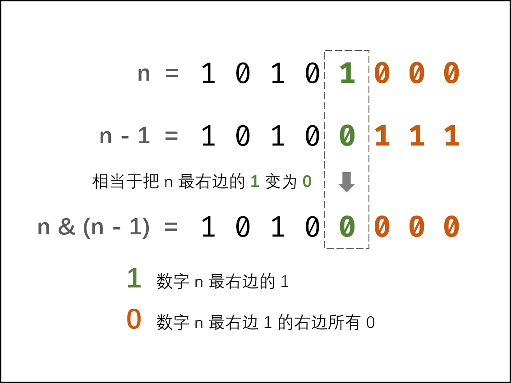

<!-- Tag: 位运算 -->

<summary><b>问题简述</b></summary>

```txt
输入是一个无符号整数，返回其二进制表达式中数字位数为 '1' 的个数
```

<details><summary><b>详细描述</b></summary>

```txt
编写一个函数，输入是一个无符号整数（以二进制串的形式），返回其二进制表达式中数字位数为 '1' 的个数（也被称为 汉明重量).）。

提示：
    请注意，在某些语言（如 Java）中，没有无符号整数类型。在这种情况下，输入和输出都将被指定为有符号整数类型，并且不应影响您的实现，因为无论整数是有符号的还是无符号的，其内部的二进制表示形式都是相同的。
    在 Java 中，编译器使用 二进制补码 记法来表示有符号整数。因此，在上面的 示例 3 中，输入表示有符号整数 -3。

示例 1：
    输入：n = 11 (控制台输入 00000000000000000000000000001011)
    输出：3
    解释：输入的二进制串 00000000000000000000000000001011 中，共有三位为 '1'。
示例 2：
    输入：n = 128 (控制台输入 00000000000000000000000010000000)
    输出：1
    解释：输入的二进制串 00000000000000000000000010000000 中，共有一位为 '1'。
示例 3：
    输入：n = 4294967293 (控制台输入 11111111111111111111111111111101，部分语言中 n = -3）
    输出：31
    解释：输入的二进制串 11111111111111111111111111111101 中，共有 31 位为 '1'。

提示：
    输入必须是长度为 32 的 二进制串 。

来源：力扣（LeetCode）
链接：https://leetcode-cn.com/problems/er-jin-zhi-zhong-1de-ge-shu-lcof
著作权归领扣网络所有。商业转载请联系官方授权，非商业转载请注明出处。
```

</details>

<summary><b>思路</b></summary>

<!-- <div align="center"></div> -->

<details><summary><b>Python：法1</b></summary>

```python
class Solution:
    def hammingWeight(self, n: int) -> int:
        ret = 0
        while n:
            # if n % 2 == 1:  # 是奇数
            #     ret += 1
            ret += n & 1  # 同上等价
            n >>= 1

        return ret
```

</details>

<details><summary><b>Python：法2</b></summary>

```python
class Solution:
    def hammingWeight(self, n: int) -> int:
        res = 0
        while n:
            res += 1
            n &= n - 1  # 消去最右边的 1，能循环几次就有几个 1
        return res
```

图解：

<div align="center"></div>


</details>

