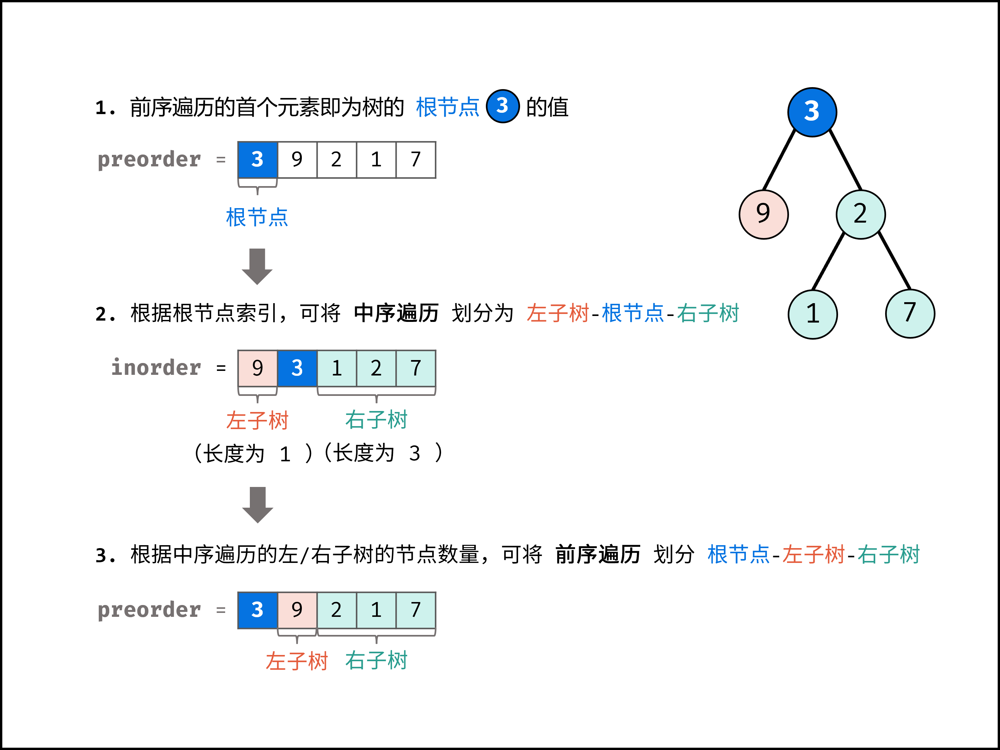

# 树、二叉树

[Problems Index](#problems-index)

<!-- Tag: 树、二叉树 -->

## 二叉树的遍历

```txt
// 输入：[1,2,3,4,5,6,7]

//      1
//    /   \
//   2     3
//  / \   / \
// 4   5 6   7

// 先序：[1,2,4,5,3,6,7]
// 中序：[4,2,5,1,6,3,7]
// 后序：[4,5,2,6,7,3,1]
// 层序：[1,2,4,5,3,6,7]
```

### 先序/中序/后序遍历
- 先序/中序/后序的区别（详见代码）：
    - 首先访问根节点就是**先序**；
    - 中间访问根节点就是**中序**；
    - 最后访问根节点就是**后序**；

<details><summary><b>代码（C++）</b></summary>

```cpp

/**
* Definition for a binary tree node.
* struct TreeNode {
*     int val;
*     TreeNode *left;
*     TreeNode *right;
*     TreeNode(int x) : val(x), left(NULL), right(NULL) {}
* };
*/
class Solution {

public:
    vector<int> tmp(TreeNode* root) {
        vector<int> ret;
        preOrder(root, ret);
        return ret;
    }

    // 前序遍历
    void preOrder(TreeNode* root, vector<int> &arr) {
        if (root == nullptr) return;

        arr.push_back(root->val);  // 先序
        preOrder(root->left, arr);
        preOrder(root->right, arr);
    }

    // 中序遍历
    void inOrder(TreeNode* root, vector<int> &arr) {
        if (root == nullptr) return;

        inOrder(root->left, arr);
        arr.push_back(root->val);  // 中序
        inOrder(root->right, arr);
    }

    // 后序遍历
    void postOrder(TreeNode* root, vector<int> &arr) {
        if (root == nullptr) return;

        postOrder(root->left, arr);
        postOrder(root->right, arr);
        arr.push_back(root->val);  // 后序
    }
};
```

</details>


### 层序遍历
1. 申请辅助队列 q；
2. 将树的根结点入队；
3. 如果 q 不为空，则将头结点出队记为 node；如果 node 的左节点不为空，则将左节点入队；如果 node 的右节点不为空，则将右节点入队；
4. 重复 2、3，直到 q 为空

<details><summary><b>代码（C++）</b></summary>

```cpp
/**
 * Definition for a binary tree node.
 * struct TreeNode {
 *     int val;
 *     TreeNode *left;
 *     TreeNode *right;
 *     TreeNode(int x) : val(x), left(NULL), right(NULL) {}
 * };
 */
class Solution {

public:
    vector<int> levelOrder(TreeNode* root) {
        
        vector<int> ret;
        queue<TreeNode*> q;  // 辅助队列
        
        if (root) {
            q.push(root);
        }

        while (!q.empty()) {
            TreeNode* node = q.front();  // 取出并弹出队首
            q.pop();

            ret.push_back(node->val);
            if (node->left) {
                q.push(node->left);
            }
            if (node->right) {
                q.push(node->right);
            }
        }

        return ret;
    }
};
```

</details>

Problems Index
---
- [`LeetCode No.0104 二叉树的最大深度 (简单, 2021-10)`](#leetcode-no0104-二叉树的最大深度-简单-2021-10)
- [`LeetCode No.0111 二叉树的最小深度 (简单, 2021-10)`](#leetcode-no0111-二叉树的最小深度-简单-2021-10)
- [`LeetCode No.0437 路径总和3 (中等, 2021-10)`](#leetcode-no0437-路径总和3-中等-2021-10)
- [`剑指Offer No.0007 重建二叉树 (中等, 2021-11)`](#剑指offer-no0007-重建二叉树-中等-2021-11)
- [`剑指Offer No.0026 树的子结构 (中等, 2021-11)`](#剑指offer-no0026-树的子结构-中等-2021-11)
- [`剑指Offer No.0027 二叉树的镜像 (简单, 2021-11)`](#剑指offer-no0027-二叉树的镜像-简单-2021-11)
- [`剑指Offer No.0028 对称的二叉树 (简单, 2021-11)`](#剑指offer-no0028-对称的二叉树-简单-2021-11)
- [`剑指Offer No.0032 层序遍历二叉树 (中等, 2021-11)`](#剑指offer-no0032-层序遍历二叉树-中等-2021-11)
- [`剑指Offer No.0054 二叉搜索树的第k大节点 (简单, 2021-11)`](#剑指offer-no0054-二叉搜索树的第k大节点-简单-2021-11)
- [`剑指Offer No.0055 二叉树的深度 (简单, 2021-11)`](#剑指offer-no0055-二叉树的深度-简单-2021-11)

---

### `LeetCode No.0104 二叉树的最大深度 (简单, 2021-10)`


[](数据结构-树、二叉树.md)
[](算法-递归(迭代)、分治.md)
[](题集-LeetCode.md)
<!-- Tag: 二叉树，递归 -->

<summary><b>问题描述</b></summary>

```txt
给定一个二叉树，找出其最大深度。

二叉树的深度为根节点到最远叶子节点的最长路径上的节点数。

示例：
    给定二叉树 [3,9,20,null,null,15,7]，
        3
       / \
      9  20
        /  \
       15   7
    返回它的最大深度 3 。

来源：力扣（LeetCode）
链接：https://leetcode-cn.com/problems/maximum-depth-of-binary-tree
著作权归领扣网络所有。商业转载请联系官方授权，非商业转载请注明出处。
```

<summary><b>思路</b></summary>

- 递归：当前二叉树的最大深度等于**左右子树的最大深度** `+ 1`

<details><summary><b>Python</b></summary>

```python
# Definition for a binary tree node.
# class TreeNode:
#     def __init__(self, val=0, left=None, right=None):
#         self.val = val
#         self.left = left
#         self.right = right

class Solution:
    def maxDepth(self, root: TreeNode) -> int:
        if not root:  # 尾递归
            return 0
        
        return max(self.maxDepth(root.left), self.maxDepth(root.right)) + 1
```

</details>

---
### `LeetCode No.0111 二叉树的最小深度 (简单, 2021-10)`


[](数据结构-树、二叉树.md)
[](算法-深度优先搜索(DFS).md)
[](题集-LeetCode.md)
<!-- Tag: 二叉树，DFS -->

<summary><b>问题描述</b></summary>

```txt
给定一个二叉树，找出其最小深度。

最小深度是从根节点到最近叶子节点的最短路径上的节点数量。

示例：
    给定二叉树 [3,9,20,null,null,15,7]，
        3
       / \
      9  20
        /  \
       15   7
    返回它的最小深度 2 。

来源：力扣（LeetCode）
链接：https://leetcode-cn.com/problems/minimum-depth-of-binary-tree
著作权归领扣网络所有。商业转载请联系官方授权，非商业转载请注明出处。
```

<summary><b>思路</b></summary>

- 深度优先搜索，记录过程中的最小深度；

<details><summary><b>Python：深度优先搜索</b></summary>

```python
# Definition for a binary tree node.
# class TreeNode:
#     def __init__(self, val=0, left=None, right=None):
#         self.val = val
#         self.left = left
#         self.right = right

class Solution:
    def minDepth(self, root: TreeNode) -> int:
        """"""
        if not root:  # 尾递归1
            return 0

        if not root.left and not root.right:  # 尾递归 2 *
            return 1
        
        min_depth = 10**5 + 10
        if root.left:
            min_depth = min(self.minDepth(root.left), min_depth)
        if root.right:
            min_depth = min(self.minDepth(root.right), min_depth)
        
        return min_depth + 1
```

</details>

---
### `LeetCode No.0437 路径总和3 (中等, 2021-10)`


[](数据结构-树、二叉树.md)
[](算法-深度优先搜索(DFS).md)
[](技巧-前缀和.md)
[](题集-LeetCode.md)
<!-- Tag: 二叉树、深度优先搜索、前缀和 -->

<summary><b>问题描述</b></summary>

```txt
给定一个二叉树的根节点 root ，和一个整数 targetSum ，求该二叉树里节点值之和等于 targetSum 的 路径 的数目。

路径 不需要从根节点开始，也不需要在叶子节点结束，但是路径方向必须是向下的（只能从父节点到子节点）。

示例 1：（见图示）
    输入：root = [10,5,-3,3,2,null,11,3,-2,null,1], targetSum = 8
    输出：3
    解释：和等于 8 的路径有 3 条，如图所示。
示例 2：
    输入：root = [5,4,8,11,null,13,4,7,2,null,null,5,1], targetSum = 22
    输出：3

提示:
    二叉树的节点个数的范围是 [0,1000]
    -10^9 <= Node.val <= 10^9 
    -1000 <= targetSum <= 1000 

来源：力扣（LeetCode）
链接：https://leetcode-cn.com/problems/path-sum-iii
著作权归领扣网络所有。商业转载请联系官方授权，非商业转载请注明出处。
```

<div align="center"></div>


<summary><b>思路</b></summary>

<details><summary><b>法1）Python：双重递归</b></summary>

```python
# Definition for a binary tree node.
class TreeNode:
    def __init__(self, val=0, left=None, right=None):
        self.val = val
        self.left = left
        self.right = right


class Solution:
    def pathSum(self, root: TreeNode, targetSum: int) -> int:  # noqa
        """"""
        if root is None:
            return 0

        # 双重递归
        ret = self.dfs_root(root, targetSum)
        # 把左右节点当做根节点都遍历一遍
        ret += self.pathSum(root.left, targetSum)
        ret += self.pathSum(root.right, targetSum)

        return ret

    def dfs_root(self, root, targetSum):  # noqa
        """ 计算从根节点开始的路径数 """
        if root is None:
            return 0

        ans = 0
        if root.val == targetSum:  # 因为节点的值可能为 0，所以这里还不能直接返回
            ans += 1

        # 差值
        delta_sum = targetSum - root.val

        # 继续遍历左右子树
        ans += self.dfs_root(root.left, delta_sum)
        ans += self.dfs_root(root.right, delta_sum)
        return ans
```
</details>

<details><summary><b>法2）Python：前缀和+DFS</b></summary>

```python
from collections import defaultdict


# Definition for a binary tree node.
class TreeNode:
    def __init__(self, val=0, left=None, right=None):
        self.val = val
        self.left = left
        self.right = right


class Solution:
    # 保存前缀和
    prefix = defaultdict(int)
    targetSum: int

    def pathSum(self, root: TreeNode, targetSum: int) -> int:  # noqa
        """ 解法2：前缀和 + DFS """
        self.prefix[0] = 1
        self.targetSum = targetSum
        return self.dfs(root, 0)

    def dfs(self, root, cur):
        if root is None:
            return 0

        ret = 0
        cur += root.val
        ret += self.prefix[cur - self.targetSum]

        self.prefix[cur] += 1
        ret += self.dfs(root.left, cur)
        ret += self.dfs(root.right, cur)
        self.prefix[cur] -= 1

        return ret
```

</details>

---
### `剑指Offer No.0007 重建二叉树 (中等, 2021-11)`


[](数据结构-树、二叉树.md)
[](算法-递归(迭代)、分治.md)
[](题集-剑指Offer.md)
<!-- Tag: 二叉树、分治 -->

<summary><b>问题简述</b></summary>

```txt
给出二叉树前序遍历和中序遍历的结果，重建该二叉树并返回其根节点。
```

<details><summary><b>详细描述</b></summary>

```txt
输入某二叉树的前序遍历和中序遍历的结果，请构建该二叉树并返回其根节点。
假设输入的前序遍历和中序遍历的结果中都不含重复的数字。

示例 1:
    Input: preorder = [3,9,20,15,7], inorder = [9,3,15,20,7]
    Output: [3,9,20,null,null,15,7]
示例 2:
    Input: preorder = [-1], inorder = [-1]
    Output: [-1]

来源：力扣（LeetCode）
链接：https://leetcode-cn.com/problems/zhong-jian-er-cha-shu-lcof
著作权归领扣网络所有。商业转载请联系官方授权，非商业转载请注明出处。
```

<!-- <div align="center"></div> -->

</details>


<summary><b>思路</b></summary>

- 前序遍历，节点按照 `[ 根节点 | 左子树 | 右子树 ]` 的顺序输出。
- 中序遍历，节点按照 `[ 左子树 | 根节点 | 右子树 ]` 的顺序输出。
- 可知：
    - 前序遍历的首元素为根节点 node 的值。
    - 在中序遍历的结果中搜索根节点的索引 ，可将**中序遍历**划分为 `[ 左子树 | 根节点 | 右子树 ]` 。
    - 根据中序遍历中的左（右）子树的节点数量，可将**前序遍历**划分为 `[ 根节点 | 左子树 | 右子树 ]` 。

<div align="center"></div>


<details><summary><b>Python</b></summary>

```python
# Definition for a binary tree node.
# class TreeNode:
#     def __init__(self, x):
#         self.val = x
#         self.left = None
#         self.right = None

class Solution:
    def buildTree(self, preorder: List[int], inorder: List[int]) -> TreeNode:
        if len(preorder) < 1 or len(inorder) < 1:  # 两个都判断一下
            return None

        # 建立根节点
        root_val = preorder[0]
        root = TreeNode(root_val)
        root_idx = inorder.index(root_val)  # 找到根节点在中序遍历的位置

        # 截取左子树的 preorder 和 inorder，递归建立左子树
        inorder_left = inorder[:root_idx]
        preorder_left = preorder[1: len(inorder_left) + 1]
        root.left = self.buildTree(preorder_left, inorder_left)
        # 截取右子树的 preorder 和 inorder，递归建立右子树
        inorder_right = inorder[root_idx + 1:]
        preorder_right = preorder[-len(inorder_right):]
        root.right = self.buildTree(preorder_right, inorder_right)
        return root
```

- 更常见的写法会使用一个字典来保存每个节点在中序遍历中的位置，取代`root_idx = inorder.index(root_val)` 这一步，
- 但是这样做就必须每次从最初的 preorder 和 inorder 中截取左右子树的片段，代码会变得比较复杂，传递的参数比较多，故没有采用这种写法；

</details>

---
### `剑指Offer No.0026 树的子结构 (中等, 2021-11)`


[](数据结构-树、二叉树.md)
[](算法-递归(迭代)、分治.md)
[](题集-剑指Offer.md)
<!-- Tag: 二叉树、递归 -->

<summary><b>问题简述</b></summary>

```txt
输入两棵二叉树A和B，判断B是不是A的子结构(约定空树不是任意一个树的子结构)
```

<details><summary><b>详细描述</b></summary>

```txt
输入两棵二叉树A和B，判断B是不是A的子结构。(约定空树不是任意一个树的子结构)

B是A的子结构， 即 A中有出现和B相同的结构和节点值。

例如:
    给定的树 A:
         3
        / \
       4   5
      / \
     1   2
    
    给定的树 B：
       4 
      /
     1
    返回 true，因为 B 与 A 的一个子树拥有相同的结构和节点值。

示例 1：
    输入：A = [1,2,3], B = [3,1]
    输出：false
示例 2：
    输入：A = [3,4,5,1,2], B = [4,1]
    输出：true

限制：
    0 <= 节点个数 <= 10000

来源：力扣（LeetCode）
链接：https://leetcode-cn.com/problems/shu-de-zi-jie-gou-lcof
著作权归领扣网络所有。商业转载请联系官方授权，非商业转载请注明出处。
```

<!-- <div align="center"></div> -->

</details>


<summary><b>思路</b></summary>

> [树的子结构（先序遍历 + 包含判断，清晰图解）](https://leetcode-cn.com/problems/shu-de-zi-jie-gou-lcof/solution/mian-shi-ti-26-shu-de-zi-jie-gou-xian-xu-bian-li-p/)

1. 先序遍历 A，然后确定 B 是否为 A 的子结构；
2. 如何确定子结构：
    - 如果 B 的根节点与 A 的某子节点 C 相等；
    - 递归判断 C 和 B 的左子节点是否相等；
    - 递归判断 C 和 B 的右子节点是否相等；
3. 确定尾递归；


<details><summary><b>C++：递归</b></summary>

```cpp
/**
 * Definition for a binary tree node.
 * struct TreeNode {
 *     int val;
 *     TreeNode *left;
 *     TreeNode *right;
 *     TreeNode(int x) : val(x), left(NULL), right(NULL) {}
 * };
 */
class Solution {
public:
    bool isSubStructure(TreeNode* A, TreeNode* B) {
        if (A == nullptr || B == nullptr) return false;

        return isSubTree(A, B)
            || isSubStructure(A->left, B) 
            || isSubStructure(A->right, B);
    }

    bool isSubTree(TreeNode* A, TreeNode* B) {
        if (B == nullptr) return true; 
        if (A == nullptr) return false;

        if (A->val == B->val) {
            return isSubTree(A->left, B->left) && isSubTree(A->right, B->right);
        } else {
            return false;
        }
    }
};
```

</details>

---
### `剑指Offer No.0027 二叉树的镜像 (简单, 2021-11)`


[](数据结构-树、二叉树.md)
[](算法-递归(迭代)、分治.md)
[](题集-剑指Offer.md)
<!-- Tag: 二叉树、递归 -->

<summary><b>问题简述</b></summary>

```txt
输入一个二叉树，输出它的镜像。
```

<details><summary><b>详细描述</b></summary>

```txt
请完成一个函数，输入一个二叉树，该函数输出它的镜像。

例如输入：

     4
   /   \
  2     7
 / \   / \
1   3 6   9

镜像输出：

     4
   /   \
  7     2
 / \   / \
9   6 3   1

示例 1：
    输入：root = [4,2,7,1,3,6,9]
    输出：[4,7,2,9,6,3,1]

限制：
    0 <= 节点个数 <= 1000

来源：力扣（LeetCode）
链接：https://leetcode-cn.com/problems/er-cha-shu-de-jing-xiang-lcof
著作权归领扣网络所有。商业转载请联系官方授权，非商业转载请注明出处。
```

<!-- <div align="center"></div> -->

</details>


<summary><b>思路</b></summary>

- 所谓镜像，实际上就是调换左右子树，然后递归应用到所有子树；
- 参考 `def swap(a,b): a, b = b, a`


<details><summary><b>Python</b></summary>

```python
# Definition for a binary tree node.
# class TreeNode:
#     def __init__(self, x):
#         self.val = x
#         self.left = None
#         self.right = None

class Solution:
    def mirrorTree(self, root: TreeNode) -> TreeNode:
        """"""
        if root is None: return None

        # 交换左右子树
        root.left, root.right = root.right, root.left

        # 递归应用到左右子树
        self.mirrorTree(root.left)
        self.mirrorTree(root.right)

        return root
```

</details>

---
### `剑指Offer No.0028 对称的二叉树 (简单, 2021-11)`


[](数据结构-树、二叉树.md)
[](算法-递归(迭代)、分治.md)
[](题集-剑指Offer.md)
<!-- Tag: 二叉树、递归 -->

<summary><b>问题简述</b></summary>

```txt
判断一棵二叉树是不是对称的。
```

<details><summary><b>详细描述</b></summary>

```txt
请实现一个函数，用来判断一棵二叉树是不是对称的。如果一棵二叉树和它的镜像一样，那么它是对称的。

例如，二叉树 [1,2,2,3,4,4,3] 是对称的。

    1
   / \
  2   2
 / \ / \
3  4 4  3

但是下面这个 [1,2,2,null,3,null,3] 则不是镜像对称的:

    1
   / \
  2   2
   \   \
   3    3
 

示例 1：
    输入：root = [1,2,2,3,4,4,3]
    输出：true
示例 2：
    输入：root = [1,2,2,null,3,null,3]
    输出：false
 

限制：
    0 <= 节点个数 <= 1000

来源：力扣（LeetCode）
链接：https://leetcode-cn.com/problems/dui-cheng-de-er-cha-shu-lcof
著作权归领扣网络所有。商业转载请联系官方授权，非商业转载请注明出处。
```

<!-- <div align="center"></div> -->

</details>


<summary><b>思路</b></summary>

- 注意除了根节点外，比较的左右子树并不是来自同一个节点；

<div align="center"></div>


<details><summary><b>C++</b></summary>

```cpp
/**
 * Definition for a binary tree node.
 * struct TreeNode {
 *     int val;
 *     TreeNode *left;
 *     TreeNode *right;
 *     TreeNode(int x) : val(x), left(NULL), right(NULL) {}
 * };
 */
class Solution {
public:
    bool isSymmetric(TreeNode* root) {
        if (root == nullptr) 
            return true;

        return dfs(root->left, root->right);
    }

    bool dfs(TreeNode* l, TreeNode* r) {  // 注意，出了根节点外，l 和 r 并不是同一节点的左右子树，理解这一点很重要
        if (l == nullptr && r == nullptr) 
            return true;
        if (l == nullptr || r == nullptr) 
            return false;
            
        if (l->val == r->val) {
            return dfs(l->left, r->right) && dfs(l->right, r->left);
        } else {
            return false;
        }

    }
};
```

</details>

---
### `剑指Offer No.0032 层序遍历二叉树 (中等, 2021-11)`


[](数据结构-树、二叉树.md)
[](数据结构-栈(单调栈)、队列.md)
[](题集-剑指Offer.md)
<!-- Tag: 二叉树、队列 -->

<summary><b>问题简述</b></summary>

```txt
层序遍历二叉树
```

<details><summary><b>详细描述</b></summary>

```txt
从上到下打印出二叉树的每个节点，同一层的节点按照从左到右的顺序打印。

例如:
    给定二叉树: [3,9,20,null,null,15,7],

        3
    / \
    9  20
        /  \
    15   7
返回：
    [3,9,20,15,7]
 
提示：
    节点总数 <= 1000


来源：力扣（LeetCode）
链接：https://leetcode-cn.com/problems/cong-shang-dao-xia-da-yin-er-cha-shu-lcof
著作权归领扣网络所有。商业转载请联系官方授权，非商业转载请注明出处。
```

<!-- <div align="center"></div> -->

</details>


<summary><b>思路</b></summary>

- 利用辅助队列 q；
    1. 将树的根结点入队；
    2. 如果 q 不为空，则将头结点出队记为 node；如果 node 的左节点不为空，则将左节点入队；如果 node 的右节点不为空，则将右节点入队；
    3. 重复 2、3，直到 q 为空


<details><summary><b>C++</b></summary>

```cpp
/**
 * Definition for a binary tree node.
 * struct TreeNode {
 *     int val;
 *     TreeNode *left;
 *     TreeNode *right;
 *     TreeNode(int x) : val(x), left(NULL), right(NULL) {}
 * };
 */
class Solution {

public:
    vector<int> levelOrder(TreeNode* root) {
        
        vector<int> ret;
        queue<TreeNode*> q;  // 辅助队列
        
        
        if (root)
            q.push(root);

        while (!q.empty()) {
            TreeNode* node = q.front();
            q.pop();

            ret.push_back(node->val);
            if (node->left) {
                q.push(node->left);
            }
            if (node->right) {
                q.push(node->right);
            }
        }

        return ret;
    }
};
```

</details>

---
### `剑指Offer No.0054 二叉搜索树的第k大节点 (简单, 2021-11)`


[](数据结构-树、二叉树.md)
[](算法-深度优先搜索(DFS).md)
[](题集-剑指Offer.md)
<!-- Tag: 二叉树、dfs -->

<summary><b>问题简述</b></summary>

```txt
给定一棵二叉搜索树，请找出其中第k大的节点。
```

<details><summary><b>详细描述</b></summary>

```txt
给定一棵二叉搜索树，请找出其中第k大的节点。

示例 1:
    输入: root = [3,1,4,null,2], k = 1
     3
    / \
   1   4
    \
     2
    输出: 4
示例 2:
    输入: root = [5,3,6,2,4,null,null,1], k = 3
        5
       / \
      3   6
     / \
    2   4
   /
  1
    输出: 4

限制：
    1 ≤ k ≤ 二叉搜索树元素个数

来源：力扣（LeetCode）
链接：https://leetcode-cn.com/problems/er-cha-sou-suo-shu-de-di-kda-jie-dian-lcof
著作权归领扣网络所有。商业转载请联系官方授权，非商业转载请注明出处。
```

<!-- <div align="center"></div> -->

</details>


<summary><b>思路</b></summary>

- 二叉搜索树的性质：中序遍历的结果为递增序列；
- 为了得到第 K 大，需要递减序列，“反向”中序遍历即可：即按“右中左”的顺序深度搜索；
- 利用辅助变量提前结束搜索；


<details><summary><b>C++：反向中序遍历</b></summary>

```cpp
/**
 * Definition for a binary tree node.
 * struct TreeNode {
 *     int val;
 *     TreeNode *left;
 *     TreeNode *right;
 *     TreeNode(int x) : val(x), left(NULL), right(NULL) {}
 * };
 */
class Solution {
    int k;
    int ret;
public:
    int kthLargest(TreeNode* root, int k) {
        this->k = k;
        inOrder(root);
        return this->ret;
    }

    void inOrder(TreeNode* node) {
        if (node == nullptr) return;

        inOrder(node->right);  // 先遍历右子树
        if (this->k == 0) return;
        this->k -= 1;
        if (this->k == 0) this->ret = node->val;
        inOrder(node->left);
    }
};
```

</details>

---
### `剑指Offer No.0055 二叉树的深度 (简单, 2021-11)`


[](数据结构-树、二叉树.md)
[](算法-递归(迭代)、分治.md)
[](题集-剑指Offer.md)
<!-- Tag: 二叉树、递归 -->

<summary><b>问题简述</b></summary>

```txt
输入一棵二叉树的根节点，求该树的深度。
```

<details><summary><b>详细描述</b></summary>

```txt
输入一棵二叉树的根节点，求该树的深度。从根节点到叶节点依次经过的节点（含根、叶节点）形成树的一条路径，最长路径的长度为树的深度。

例如：
给定二叉树 [3,9,20,null,null,15,7]，

    3
   / \
  9  20
    /  \
   15   7
返回它的最大深度 3 。

提示：
    节点总数 <= 10000

来源：力扣（LeetCode）
链接：https://leetcode-cn.com/problems/er-cha-shu-de-shen-du-lcof
著作权归领扣网络所有。商业转载请联系官方授权，非商业转载请注明出处。
```

<!-- <div align="center"></div> -->

</details>


<summary><b>思路</b></summary>

- 递归公式：`最大深度 := 1 + 子树的最大深度`


<details><summary><b>C++</b></summary>

```cpp
/**
 * Definition for a binary tree node.
 * struct TreeNode {
 *     int val;
 *     TreeNode *left;
 *     TreeNode *right;
 *     TreeNode(int x) : val(x), left(NULL), right(NULL) {}
 * };
 */
class Solution {
public:
    int maxDepth(TreeNode* root) {
        if (root == NULL) return 0;

        return 1 + max(maxDepth(root->left), maxDepth(root->right));
    }
};
```

</details>

---
