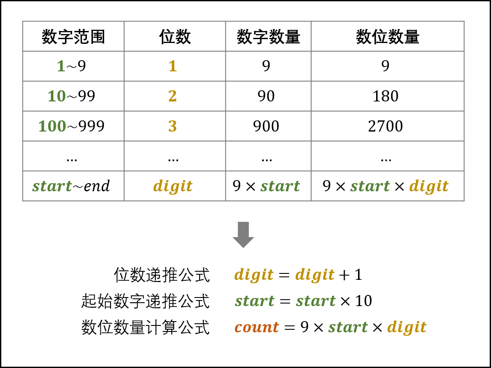
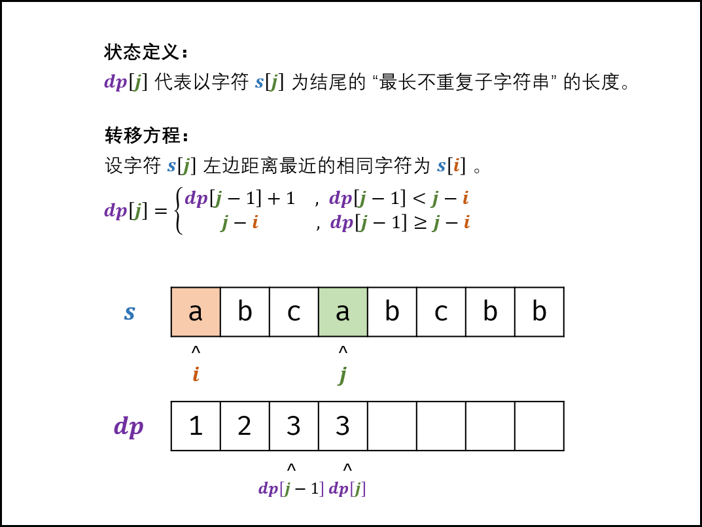

# 剑指Offer

[Problems Index](#problems-index)

<!-- Tag: 剑指Offer -->

Problems Index
---
- [`剑指Offer No.0003 数组中重复的数字 (简单, 2021-11)`](#剑指offer-no0003-数组中重复的数字-简单-2021-11)
- [`剑指Offer No.0004 二维数组中的查找 (中等, 2021-11)`](#剑指offer-no0004-二维数组中的查找-中等-2021-11)
- [`剑指Offer No.0005 替换空格 (简单, 2021-11)`](#剑指offer-no0005-替换空格-简单-2021-11)
- [`剑指Offer No.0006 从尾到头打印链表 (简单, 2021-11)`](#剑指offer-no0006-从尾到头打印链表-简单-2021-11)
- [`剑指Offer No.0007 重建二叉树 (中等, 2021-11)`](#剑指offer-no0007-重建二叉树-中等-2021-11)
- [`剑指Offer No.0009 用两个栈实现队列 (简单, 2021-11)`](#剑指offer-no0009-用两个栈实现队列-简单-2021-11)
- [`剑指Offer No.0010 1-斐波那契数列 (简单, 2021-11)`](#剑指offer-no0010-1-斐波那契数列-简单-2021-11)
- [`剑指Offer No.0010 2-青蛙跳台阶问题 (简单, 2021-11)`](#剑指offer-no0010-2-青蛙跳台阶问题-简单-2021-11)
- [`剑指Offer No.0011 旋转数组的最小数字 (简单, 2021-11)`](#剑指offer-no0011-旋转数组的最小数字-简单-2021-11)
- [`剑指Offer No.0012 矩阵中的路径 (中等, 2021-11)`](#剑指offer-no0012-矩阵中的路径-中等-2021-11)
- [`剑指Offer No.0013 机器人的运动范围 (中等, 2021-11)`](#剑指offer-no0013-机器人的运动范围-中等-2021-11)
- [`剑指Offer No.0014 剪绳子1 (中等, 2021-11)`](#剑指offer-no0014-剪绳子1-中等-2021-11)
- [`剑指Offer No.0015 二进制中1的个数 (简单, 2021-11)`](#剑指offer-no0015-二进制中1的个数-简单-2021-11)
- [`剑指Offer No.0016 数值的整数次方（快速幂） (中等, 2021-11)`](#剑指offer-no0016-数值的整数次方快速幂-中等-2021-11)
- [`剑指Offer No.0017 打印从1到最大的n位数（全排列） (简单, 2021-11)`](#剑指offer-no0017-打印从1到最大的n位数全排列-简单-2021-11)
- [`剑指Offer No.0018 删除链表的节点 (简单, 2021-11)`](#剑指offer-no0018-删除链表的节点-简单-2021-11)
- [`剑指Offer No.0021 调整数组顺序使奇数位于偶数前面 (简单, 2021-11)`](#剑指offer-no0021-调整数组顺序使奇数位于偶数前面-简单-2021-11)
- [`剑指Offer No.0022 链表中倒数第k个节点 (简单, 2021-11)`](#剑指offer-no0022-链表中倒数第k个节点-简单-2021-11)
- [`剑指Offer No.0024 反转链表 (简单, 2021-11)`](#剑指offer-no0024-反转链表-简单-2021-11)
- [`剑指Offer No.0025 合并两个排序的链表 (简单, 2021-11)`](#剑指offer-no0025-合并两个排序的链表-简单-2021-11)
- [`剑指Offer No.0026 树的子结构 (中等, 2021-11)`](#剑指offer-no0026-树的子结构-中等-2021-11)
- [`剑指Offer No.0027 二叉树的镜像 (简单, 2021-11)`](#剑指offer-no0027-二叉树的镜像-简单-2021-11)
- [`剑指Offer No.0028 对称的二叉树 (简单, 2021-11)`](#剑指offer-no0028-对称的二叉树-简单-2021-11)
- [`剑指Offer No.0029 顺时针打印矩阵 (中等, 2021-11)`](#剑指offer-no0029-顺时针打印矩阵-中等-2021-11)
- [`剑指Offer No.0032 层序遍历二叉树 (中等, 2021-11)`](#剑指offer-no0032-层序遍历二叉树-中等-2021-11)
- [`剑指Offer No.0042 连续子数组的最大和 (简单, 2021-10)`](#剑指offer-no0042-连续子数组的最大和-简单-2021-10)
- [`剑指Offer No.0044 数字序列中某一位的数字 (中等, 2021-11)`](#剑指offer-no0044-数字序列中某一位的数字-中等-2021-11)
- [`剑指Offer No.0047 礼物的最大价值 (中等, 2021-11)`](#剑指offer-no0047-礼物的最大价值-中等-2021-11)
- [`剑指Offer No.0048 最长不含重复字符的子字符串 (中等, 2021-11)`](#剑指offer-no0048-最长不含重复字符的子字符串-中等-2021-11)
- [`剑指Offer No.0054 二叉搜索树的第k大节点 (简单, 2021-11)`](#剑指offer-no0054-二叉搜索树的第k大节点-简单-2021-11)
- [`剑指Offer No.0055 二叉树的深度 (简单, 2021-11)`](#剑指offer-no0055-二叉树的深度-简单-2021-11)
- [`剑指Offer No.0063 买卖股票的最佳时机 (中等, 2021-11)`](#剑指offer-no0063-买卖股票的最佳时机-中等-2021-11)
- [`剑指Offer No.0067 把字符串转换成整数 (中等, 2021-11)`](#剑指offer-no0067-把字符串转换成整数-中等-2021-11)

---

### `剑指Offer No.0003 数组中重复的数字 (简单, 2021-11)`


[](技巧-哈希表(Hash).md)
[](题集-剑指Offer.md)
<!-- Tag: 哈希表 -->

<summary><b>问题简述</b></summary>

```txt
找出数组中任意一个重复的数字。
```

<details><summary><b>详细描述</b></summary>

```txt
找出数组中重复的数字。

在一个长度为 n 的数组 nums 里的所有数字都在 0～n-1 的范围内。数组中某些数字是重复的，但不知道有几个数字重复了，也不知道每个数字重复了几次。请找出数组中任意一个重复的数字。

示例 1：
    输入：
    [2, 3, 1, 0, 2, 5, 3]
    输出：2 或 3 

限制：
    2 <= n <= 100000

来源：力扣（LeetCode）
链接：https://leetcode-cn.com/problems/shu-zu-zhong-zhong-fu-de-shu-zi-lcof
著作权归领扣网络所有。商业转载请联系官方授权，非商业转载请注明出处。
```

<!-- <div align="center"></div> -->

</details>

<summary><b>思路</b></summary>

- 遍历数组，保存见过的数字，当遇到出现过的数字即返回


<details><summary><b>Python</b></summary>

```python
class Solution:
    def findRepeatNumber(self, nums: List[int]) -> int:
        tb = set()
        for i in nums:
            if i in tb:
                return i
            tb.add(i)
```

</details>

---
### `剑指Offer No.0004 二维数组中的查找 (中等, 2021-11)`


[](算法-二分法.md)
[](题集-剑指Offer.md)
<!-- Tag: 二分查找 -->

<summary><b>问题简述</b></summary>

```txt
一个 n * m 的二维数组，每一行从左到右递增，每一列从上到下递增。
输入一个整数，判断该数组中是否含有该整数。
```

<details><summary><b>详细描述</b></summary>

```txt
在一个 n * m 的二维数组中，每一行都按照从左到右递增的顺序排序，每一列都按照从上到下递增的顺序排序。请完成一个高效的函数，输入这样的一个二维数组和一个整数，判断数组中是否含有该整数。

示例:
    现有矩阵 matrix 如下：
    [
    [1,   4,  7, 11, 15],
    [2,   5,  8, 12, 19],
    [3,   6,  9, 16, 22],
    [10, 13, 14, 17, 24],
    [18, 21, 23, 26, 30]
    ]
    给定 target = 5，返回 true。
    给定 target = 20，返回 false。

限制：
    0 <= n <= 1000
    0 <= m <= 1000

来源：力扣（LeetCode）
链接：https://leetcode-cn.com/problems/er-wei-shu-zu-zhong-de-cha-zhao-lcof
著作权归领扣网络所有。商业转载请联系官方授权，非商业转载请注明出处。
```

<!-- <div align="center"></div> -->

</details>


<summary><b>思路</b></summary>

- 法1）对每一行做二分查找，时间复杂度`O(N*logM)`
- 法2）模拟二分，从左下角开始查找，打标目标值往右，小于目标值往上；


<details><summary><b>Python：模拟二分</b></summary>

```python
class Solution:
    def findNumberIn2DArray(self, matrix: List[List[int]], target: int) -> bool:
        if len(matrix) < 1:
            return False

        n, m = len(matrix), len(matrix[0])
        i, j = n - 1, 0

        while i >= 0 and j <= m - 1:
            if matrix[i][j] == target:
                return True
            elif matrix[i][j] > target:
                i -= 1
            else:  # matrix[i][j] < target:
                j += 1

        return False
```

</details>

---
### `剑指Offer No.0005 替换空格 (简单, 2021-11)`


[](数据结构-字符串.md)
[](题集-剑指Offer.md)
<!-- Tag: 字符串 -->

<summary><b>问题简述</b></summary>

```txt
实现一个函数，把字符串 s 中的每个空格替换成"%20"。
```

<details><summary><b>详细描述</b></summary>

```txt
请实现一个函数，把字符串 s 中的每个空格替换成"%20"。

示例 1：
    输入：s = "We are happy."
    输出："We%20are%20happy."

限制：
    0 <= s 的长度 <= 10000

来源：力扣（LeetCode）
链接：https://leetcode-cn.com/problems/ti-huan-kong-ge-lcof
著作权归领扣网络所有。商业转载请联系官方授权，非商业转载请注明出处。
```

<!-- <div align="center"></div> -->

</details>


<summary><b>思路</b></summary>

- Python、Java 中的字符串都是不可变类型，所以始终要申请新的容器；那么问题就很简单，替换拼接即可；
- C++ 中 string 是可变类型，因此可以尝试原地替换；


<details><summary><b>Python</b></summary>

```python
class Solution:
    def replaceSpace(self, s: str) -> str:
        buf = []
        for c in s:
            if c == ' ':
                buf.append('%20')
            else:
                buf.append(c)
        
        return ''.join(buf)
```

</details>

<details><summary><b>C++：原地替换</b></summary>

```cpp
class Solution {
public:
    string replaceSpace(string s) {
        // 统计空格数量
        int space_cnt = 0;
        for (char c : s) {
            if (c == ' ') space_cnt++;
        }
        // 修改 s 长度
        int i = s.size() - 1;  // 原来的长度
        s.resize(s.size() + 2 * space_cnt);        
        int j = s.size() - 1;  // 新的长度
        // 倒序遍历修改
        while (i < j) {
            if (s[i] != ' ')
                s[j] = s[i];
            else {
                s[j - 2] = '%';
                s[j - 1] = '2';
                s[j] = '0';
                j -= 2;
            }
            i--;
            j--;
        }
        return s;
    }
};
```

</details>

---
### `剑指Offer No.0006 从尾到头打印链表 (简单, 2021-11)`


[](数据结构-链表.md)
[](数据结构-栈(单调栈)、队列.md)
[](算法-深度优先搜索(DFS).md)
[](算法-递归(迭代)、分治.md)
[](题集-剑指Offer.md)
<!-- Tag: 链表、栈、DFS、递归 -->

<summary><b>问题简述</b></summary>

```txt
从尾到头打印链表（用数组返回）
```

<details><summary><b>详细描述</b></summary>

```txt
输入一个链表的头节点，从尾到头反过来返回每个节点的值（用数组返回）。

示例 1：
    输入：head = [1,3,2]
    输出：[2,3,1]

限制：
    0 <= 链表长度 <= 10000

来源：力扣（LeetCode）
链接：https://leetcode-cn.com/problems/cong-wei-dao-tou-da-yin-lian-biao-lcof
著作权归领扣网络所有。商业转载请联系官方授权，非商业转载请注明出处。
```

<!-- <div align="center"></div> -->

</details>


<summary><b>思路</b></summary>

- 法1）利用栈，顺序入栈，然后依次出栈即可
- 法2）利用深度优先遍历思想（二叉树的先序遍历）


<details><summary><b>Python：栈</b></summary>

```python
# Definition for singly-linked list.
# class ListNode:
#     def __init__(self, x):
#         self.val = x
#         self.next = None

class Solution:
    def reversePrint(self, head: ListNode) -> List[int]:
        stack = []
        while head:
            stack.append(head.val)
            head = head.next
        
        # ret = []
        # for _ in range(len(stack)):  # 相当于逆序遍历
        #     ret.append(stack.pop())
        # return ret
        return stack[::-1]  # 与以上代码等价
```

</details>

<details><summary><b>Python：DFS、递归</b></summary>

```python
# Definition for singly-linked list.
# class ListNode:
#     def __init__(self, x):
#         self.val = x
#         self.next = None

class Solution:
    def reversePrint(self, head: ListNode) -> List[int]:
        if head is None:
            return []

        ret = self.reversePrint(head.next)
        ret.append(head.val)

        return ret
```

</details>

---
### `剑指Offer No.0007 重建二叉树 (中等, 2021-11)`


[](数据结构-树、二叉树.md)
[](算法-递归(迭代)、分治.md)
[](题集-经典问题&代码.md)
[](题集-剑指Offer.md)
<!-- Tag: 二叉树、分治、经典 -->

<summary><b>问题简述</b></summary>

```txt
给出二叉树前序遍历和中序遍历的结果，重建该二叉树并返回其根节点。
```

<details><summary><b>详细描述</b></summary>

```txt
输入某二叉树的前序遍历和中序遍历的结果，请构建该二叉树并返回其根节点。
假设输入的前序遍历和中序遍历的结果中都不含重复的数字。

示例 1:
    Input: preorder = [3,9,20,15,7], inorder = [9,3,15,20,7]
    Output: [3,9,20,null,null,15,7]
示例 2:
    Input: preorder = [-1], inorder = [-1]
    Output: [-1]

来源：力扣（LeetCode）
链接：https://leetcode-cn.com/problems/zhong-jian-er-cha-shu-lcof
著作权归领扣网络所有。商业转载请联系官方授权，非商业转载请注明出处。
```

<!-- <div align="center"></div> -->

</details>


<summary><b>思路</b></summary>

- 前序遍历，节点按照 `[ 根节点 | 左子树 | 右子树 ]` 的顺序输出。
- 中序遍历，节点按照 `[ 左子树 | 根节点 | 右子树 ]` 的顺序输出。
- 可知：
    - 前序遍历的首元素为根节点 node 的值。
    - 在中序遍历的结果中搜索根节点的索引 ，可将**中序遍历**划分为 `[ 左子树 | 根节点 | 右子树 ]` 。
    - 根据中序遍历中的左（右）子树的节点数量，可将**前序遍历**划分为 `[ 根节点 | 左子树 | 右子树 ]` 。

<div align="center"></div>


<details><summary><b>Python</b></summary>

```python
# Definition for a binary tree node.
# class TreeNode:
#     def __init__(self, x):
#         self.val = x
#         self.left = None
#         self.right = None

class Solution:
    def buildTree(self, preorder: List[int], inorder: List[int]) -> TreeNode:
        if len(preorder) < 1 or len(inorder) < 1:  # 两个都判断一下
            return None

        # 建立根节点
        root_val = preorder[0]
        root = TreeNode(root_val)
        root_idx = inorder.index(root_val)  # 找到根节点在中序遍历的位置

        # 截取左子树的 preorder 和 inorder，递归建立左子树
        inorder_left = inorder[:root_idx]
        preorder_left = preorder[1: len(inorder_left) + 1]
        root.left = self.buildTree(preorder_left, inorder_left)
        # 截取右子树的 preorder 和 inorder，递归建立右子树
        inorder_right = inorder[root_idx + 1:]
        preorder_right = preorder[-len(inorder_right):]
        root.right = self.buildTree(preorder_right, inorder_right)
        return root
```

- 更常见的写法会使用一个字典来保存每个节点在中序遍历中的位置，取代`root_idx = inorder.index(root_val)` 这一步，
- 但是这样做就必须每次从最初的 preorder 和 inorder 中截取左右子树的片段，代码会变得比较复杂，传递的参数比较多，故没有采用这种写法；

</details>

---
### `剑指Offer No.0009 用两个栈实现队列 (简单, 2021-11)`


[](数据结构-栈(单调栈)、队列.md)
[](数据结构-栈(单调栈)、队列.md)
[](题集-剑指Offer.md)
<!-- Tag: 栈、队列 -->

<summary><b>问题简述</b></summary>

```txt
用两个栈实现一个队列。
队列包含两个函数 appendTail 和 deleteHead(若队列中没有元素，deleteHead 操作返回 -1 )
```

<details><summary><b>详细描述</b></summary>

```txt
用两个栈实现一个队列。队列的声明如下，请实现它的两个函数 appendTail 和 deleteHead ，分别完成在队列尾部插入整数和在队列头部删除整数的功能。(若队列中没有元素，deleteHead 操作返回 -1 )

示例 1：
    输入：
    ["CQueue","appendTail","deleteHead","deleteHead"]
    [[],[3],[],[]]
    输出：[null,null,3,-1]
示例 2：
    输入：
    ["CQueue","deleteHead","appendTail","appendTail","deleteHead","deleteHead"]
    [[],[],[5],[2],[],[]]
    输出：[null,-1,null,null,5,2]

提示：
    1 <= values <= 10000
    最多会对 appendTail、deleteHead 进行 10000 次调用

来源：力扣（LeetCode）
链接：https://leetcode-cn.com/problems/yong-liang-ge-zhan-shi-xian-dui-lie-lcof
著作权归领扣网络所有。商业转载请联系官方授权，非商业转载请注明出处。
```

<!-- <div align="center"></div> -->

</details>


<summary><b>思路</b></summary>

- 栈：先进后出；队列：先进先出；换言之，队列就是倒序输出的栈；
- 利用双栈可实现倒序输出：维护两个栈 A 和 B，将 A 中元素依次弹出并压入栈 B，再依次弹出 B 中元素，即实现了对栈 A 元素的倒序输出，即实现了队列的性质；


<details><summary><b>Python</b></summary>

```python
class CQueue:
    def __init__(self):
        self.I = []  # 入栈
        self.O = []  # 出栈

    def appendTail(self, value: int) -> None:
        self.I.append(value)  # 新元素全部加到 I

    def deleteHead(self) -> int:
        if self.O:  # 如果 O 不为空
            return self.O.pop()  # 弹出栈顶元素
        
        if not self.I:  # 如果 I 为空，说明队列为空
            return -1

        while self.I:  # 如果 I 不为空，但 O 为空，此时将 I 中元素依次加入 O  
            self.O.append(self.I.pop())
        return self.O.pop()


# Your CQueue object will be instantiated and called as such:
# obj = CQueue()
# obj.appendTail(value)
# param_2 = obj.deleteHead()
```

</details>

---
### `剑指Offer No.0010 1-斐波那契数列 (简单, 2021-11)`


[](算法-动态规划(DP、记忆化搜索).md)
[](算法-动态规划(DP、记忆化搜索).md)
[](题集-剑指Offer.md)
<!-- Tag: DP、记忆化搜索 -->

<summary><b>问题简述</b></summary>

```txt
输入 n ，求斐波那契（Fibonacci）数列的第 n 项
```

<details><summary><b>详细描述</b></summary>

```txt
写一个函数，输入 n ，求斐波那契（Fibonacci）数列的第 n 项（即 F(N)）。斐波那契数列的定义如下：
    F(0) = 0,   F(1) = 1
    F(N) = F(N - 1) + F(N - 2), 其中 N > 1.
斐波那契数列由 0 和 1 开始，之后的斐波那契数就是由之前的两数相加而得出。

答案需要取模 1e9+7（1000000007），如计算初始结果为：1000000008，请返回 1。

示例 1：
    输入：n = 2
    输出：1
示例 2：
    输入：n = 5
    输出：5

提示：
    0 <= n <= 100

来源：力扣（LeetCode）
链接：https://leetcode-cn.com/problems/fei-bo-na-qi-shu-lie-lcof
著作权归领扣网络所有。商业转载请联系官方授权，非商业转载请注明出处。
```

<!-- <div align="center"></div> -->

</details>


<summary><b>思路</b></summary>

- 法1）递归
- 法2）DP（记忆化搜索），因为每个答案只与固定的前两个结果有关，因此可以使用滚动 DP；


<details><summary><b>Python：递归（会超时）</b></summary>

```python
class Solution:
    
    def fib(self, n: int) -> int:
        if n == 0:
            return 0
        if n == 1:
            return 1
        
        MAX = 1000000007
        return (self.fib(n-1) + self.fib(n-2)) % MAX
```

</details>


<details><summary><b>Python：动态规划</b></summary>

```python
class Solution:
    
    def fib(self, n: int) -> int:
        if n == 0:
            return 0
        if n == 1:
            return 1
        
        MAX = 1000000007

        dp = [0, 1]  # 因为每个答案只与固定的前两个结果有关，所以只需要“记忆”两个答案
        for _ in range(n - 1):
            dp[0], dp[1] = dp[1], dp[0] + dp[1]
        
        return dp[1] % MAX
```

</details>

---
### `剑指Offer No.0010 2-青蛙跳台阶问题 (简单, 2021-11)`


[](算法-动态规划(DP、记忆化搜索).md)
[](题集-剑指Offer.md)
<!-- Tag: DP -->

<summary><b>问题简述</b></summary>

```txt
规定一次可以跳1级台阶或2级台阶。求跳上一个 n 级台阶总共有多少种跳法。
```

<details><summary><b>详细描述</b></summary>

```txt
一只青蛙一次可以跳上1级台阶，也可以跳上2级台阶。求该青蛙跳上一个 n 级的台阶总共有多少种跳法。

答案需要取模 1e9+7（1000000007），如计算初始结果为：1000000008，请返回 1。

示例 1：
    输入：n = 2
    输出：2
示例 2：
    输入：n = 7
    输出：21
示例 3：
    输入：n = 0
    输出：1
提示：
    0 <= n <= 100

来源：力扣（LeetCode）
链接：https://leetcode-cn.com/problems/qing-wa-tiao-tai-jie-wen-ti-lcof
著作权归领扣网络所有。商业转载请联系官方授权，非商业转载请注明出处。
```

<!-- <div align="center"></div> -->

</details>


<summary><b>思路</b></summary>

- 本题实际上就是求斐波那契数列，跳上 n 级台阶的方法数 `f(n) = f(n-1) + f(n-2)`，
- 只是初始状态不同，这里是 `f(0) = 1, f(1) = 1`；


<details><summary><b>Python：动态规划</b></summary>

```python
class Solution:
    def numWays(self, n: int) -> int:
        MAX = 1000000007

        dp = [1, 1]  # 
        for _ in range(n - 1):
            dp[0], dp[1] = dp[1], dp[0] + dp[1]
        
        return dp[1] % MAX if n > 0 else dp[0]
```

</details>

---
### `剑指Offer No.0011 旋转数组的最小数字 (简单, 2021-11)`


[](算法-二分法.md)
[](题集-剑指Offer.md)
<!-- Tag: 二分查找 -->

<summary><b>问题简述</b></summary>

```txt
求旋转数组中的最小元素；
旋转数组：将一个有序数组的前 N 个数组拼接到末尾；
例如，数组 [3,4,5,1,2] 为 [1,2,3,4,5] 的一个旋转；
```

<details><summary><b>详细描述</b></summary>

```txt
把一个数组最开始的若干个元素搬到数组的末尾，我们称之为数组的旋转。输入一个递增排序的数组的一个旋转，输出旋转数组的最小元素。例如，数组 [3,4,5,1,2] 为 [1,2,3,4,5] 的一个旋转，该数组的最小值为1。  

示例 1：
    输入：[3,4,5,1,2]
    输出：1
示例 2：
    输入：[2,2,2,0,1]
    输出：0

来源：力扣（LeetCode）
链接：https://leetcode-cn.com/problems/xuan-zhuan-shu-zu-de-zui-xiao-shu-zi-lcof
著作权归领扣网络所有。商业转载请联系官方授权，非商业转载请注明出处。
```

<!-- <div align="center"></div> -->

</details>

<summary><b>思路：二分查找</b></summary>

- 本题的难点是比较基准的确定（详见代码）
- 本题虽然是简单题，但有很多需要注意的点；
  > [旋转数组的最小数字（二分法，清晰图解）](https://leetcode-cn.com/problems/xuan-zhuan-shu-zu-de-zui-xiao-shu-zi-lcof/solution/mian-shi-ti-11-xuan-zhuan-shu-zu-de-zui-xiao-shu-3/)


<details><summary><b>Python</b></summary>

```python
class Solution:
    def minArray(self, numbers: List[int]) -> int:
        """"""
        if numbers[0] < numbers[-1]:  # 只有严格小于，才说明没有发生旋转
            return numbers[0]

        l, r = -1, len(numbers) - 1  # 本题设置为左开右闭较合适，即 (l, r]
        while l + 1 < r:
            mid = l + (r - l) // 2  # l <= mid < r
            if numbers[mid] > numbers[r]:  # 中值大于右边界，说明最小值在右侧
                l = mid  # 因为设置 l 为开区间，故不需要 l = mid + 1
            elif numbers[mid] < numbers[r]:  # 中值小于右边界，说明最小值在左侧
                r = mid  # mid 本身就可能是最小值，且 r 为闭区间，故不需要 r = mid - 1
            else:
                r -= 1  # 关键步骤，当 numbers[mid] == numbers[r] 时，无法判断旋转点 x 是在 (l, m] 还是 (m, r] 区间中，通过 r-=1 来缩小范围

        return numbers[r]  # 循环结束时，应有 l+1 == r
```

</details>

---
### `剑指Offer No.0012 矩阵中的路径 (中等, 2021-11)`


[](算法-深度优先搜索(DFS).md)
[](算法-深度优先搜索(DFS).md)
[](题集-剑指Offer.md)
<!-- Tag: DFS、DFS+回溯 -->

<summary><b>问题简述</b></summary>

```txt
给定一个 m x n 二维字符矩阵 board 和字符串 word。如果 word 存在于网格中，返回 true ；否则，返回 false 。

其中单词必须按照字母顺序，通过相邻的单元格内的字母构成，其中“相邻”单元格是那些水平相邻或垂直相邻的单元格。同一个单元格内的字母不允许被重复使用。
```

<details><summary><b>详细描述</b></summary>

```txt
给定一个 m x n 二维字符网格 board 和一个字符串单词 word 。如果 word 存在于网格中，返回 true ；否则，返回 false 。

单词必须按照字母顺序，通过相邻的单元格内的字母构成，其中“相邻”单元格是那些水平相邻或垂直相邻的单元格。同一个单元格内的字母不允许被重复使用。

例如，在下面的 3×4 的矩阵中包含单词 "ABCCED"（单词中的字母已标出）。

示例 1：
    输入：board = [["A","B","C","E"],["S","F","C","S"],["A","D","E","E"]], word = "ABCCED"
    输出：true
示例 2：
    输入：board = [["a","b"],["c","d"]], word = "abcd"
    输出：false
 
提示：
    1 <= board.length <= 200
    1 <= board[i].length <= 200
    board 和 word 仅由大小写英文字母组成
 

来源：力扣（LeetCode）
链接：https://leetcode-cn.com/problems/ju-zhen-zhong-de-lu-jing-lcof
著作权归领扣网络所有。商业转载请联系官方授权，非商业转载请注明出处。
```

<div align="center"></div>

</details>

<summary><b>思路</b></summary>

- 棋盘搜索，非常典型的 DFS + 回溯问题；

<!-- <div align="center"></div> -->

<details><summary><b>Python：DFS + 回溯</b></summary>

```python
class Solution:
    def exist(self, board: List[List[str]], word: str) -> bool:
        if len(board) < 1:
            return False

        m, n = len(board), len(board[0])

        # 使用内部函数，可以减少一些参数的传递，同时比成员方法更简洁
        def dfs(i, j, k):  # i, j, k 分别表示 board[i][j] 和 word[k]
            if not 0 <= i < m or not 0 <= j < n:  # 先判断是否越界
                return False

            if board[i][j] != word[k]:  # 这一步可以合并到越界判断，但会损失一些可读性，故分离出来单独判断
                return False
            else:  # board[i][j] == word[k]:  # 如果当前位置字符相同，继续深度搜索
                if k == len(word) - 1:  # 如果字符已经全部匹配成功，返回 True
                    return True

                # 置空，表示该位置已访问过；一些代码中会使用一个新的矩阵记录位置是否访问，这里直接在原矩阵上标记
                board[i][j] = ''
                # 继续遍历 4 个方向
                flag = dfs(i + 1, j, k + 1) or dfs(i - 1, j, k + 1) or dfs(i, j + 1, k + 1) or dfs(i, j - 1, k + 1)
                # 这一步是容易忽略的：因为需要回溯，所以必须还原该位置的元素
                board[i][j] = word[k]

                return flag

        # board 中每一个位置都可能是起始位置，所以要循环遍历
        for i in range(m):
            for j in range(n):
                if dfs(i, j, 0):
                    return True
        return False
```

</details>

---
### `剑指Offer No.0013 机器人的运动范围 (中等, 2021-11)`


[](算法-深度优先搜索(DFS).md)
[](题集-剑指Offer.md)
<!-- Tag: DFS -->

<summary><b>问题描述</b></summary>

```txt
地上有一个m行n列的方格，从坐标 [0,0] 到坐标 [m-1,n-1] 。一个机器人从坐标 [0, 0] 的格子开始移动，它每次可以向左、右、上、下移动一格（不能移动到方格外），也不能进入行坐标和列坐标的数位之和大于k的格子。例如，当k为18时，机器人能够进入方格 [35, 37] ，因为3+5+3+7=18。但它不能进入方格 [35, 38]，因为3+5+3+8=19。请问该机器人能够到达多少个格子？

示例 1：
    输入：m = 2, n = 3, k = 1
    输出：3
示例 2：
    输入：m = 3, n = 1, k = 0
    输出：1

提示：
    1 <= n,m <= 100
    0 <= k <= 20

来源：力扣（LeetCode）
链接：https://leetcode-cn.com/problems/ji-qi-ren-de-yun-dong-fan-wei-lcof
著作权归领扣网络所有。商业转载请联系官方授权，非商业转载请注明出处。
```

<summary><b>思路</b></summary>

- 本题也可以使用广度优先搜索；
  > [机器人的运动范围（ 回溯算法，DFS / BFS ，清晰图解）](https://leetcode-cn.com/problems/ji-qi-ren-de-yun-dong-fan-wei-lcof/solution/mian-shi-ti-13-ji-qi-ren-de-yun-dong-fan-wei-dfs-b/)

<!-- <div align="center"></div> -->

<details><summary><b>Python：DFS+回溯</b></summary>

```python
class Solution:
    def movingCount(self, m: int, n: int, k: int) -> int:

        def dig_sum(x):  # 求数位之和
            s = 0
            while x != 0:
                s += x % 10
                x = x // 10
            return s

        def dfs(i, j):
            if not 0 <= i < m or not 0 <= j < n or dig_sum(i) + dig_sum(j) > k:
                return 0

            if (i, j) in visited:  # 如果已经访问过
                return 0
            else:
                visited.add((i, j))  # 访问标记
                return 1 + dfs(i + 1, j) + dfs(i, j + 1)  # 因为只能往左或往右，所以只需要搜索两个方向

        visited = set()
        return dfs(0, 0)
```

</details>

---
### `剑指Offer No.0014 剪绳子1 (中等, 2021-11)`


[](算法-动态规划(DP、记忆化搜索).md)
[](技巧-贪心.md)
[](基础-模拟、数学、找规律.md)
[](题集-剑指Offer.md)
<!-- Tag: 动态规划、贪心、数学 -->

<summary><b>问题描述</b></summary>

```txt
给你一根长度为 n 的绳子，请把绳子剪成整数长度的 m 段（m、n都是整数，n>1并且m>1），每段绳子的长度记为 k[0],k[1]...k[m-1] 。请问 k[0]*k[1]*...*k[m-1] 可能的最大乘积是多少？例如，当绳子的长度是8时，我们把它剪成长度分别为2、3、3的三段，此时得到的最大乘积是18。

示例 1：
    输入: 2
    输出: 1
    解释: 2 = 1 + 1, 1 × 1 = 1
示例 2:
    输入: 10
    输出: 36
    解释: 10 = 3 + 3 + 4, 3 × 3 × 4 = 36
提示：
    2 <= n <= 58

来源：力扣（LeetCode）
链接：https://leetcode-cn.com/problems/jian-sheng-zi-lcof
著作权归领扣网络所有。商业转载请联系官方授权，非商业转载请注明出处。
```

<summary><b>思路</b></summary>

<!-- <div align="center"></div> -->

法1）动态规划
- 在不使用任何数学结论的前提下，可以把本题当做纯 DP 来做，只是复杂度会比较高：

<details><summary><b>Python：动态规划</b></summary>

```python
class Solution:
    def cuttingRope(self, n: int) -> int:
        # 对于 n = 2、3 的情况，直接硬编码
        if n == 2:
            return 1
        if n == 3:
            return 2

        # 状态定义：dp[i] 表示长度为 i 的最大乘积，其中 i > 3（注意 i 的范围）
        #   当 i <= 3 时，不满足该定义，此时不剪才是最大值
        # 初始状态（dp[0] 仅用于占位）
        dp = [0,1,2,3] + [0] * (n - 3) 

        for i in range(4, n + 1):
            for j in range(2, i):
                dp[i] = max(dp[i], dp[i-j] * dp[j])

        return dp[n]
```

</details>

法2）贪心
- 数学上可证：尽可能按长度为 3 切，如果剩余 4，则按 2、2 切；
  > 证明见：[剪绳子1（数学推导 / 贪心思想，清晰图解）](https://leetcode-cn.com/problems/jian-sheng-zi-lcof/solution/mian-shi-ti-14-i-jian-sheng-zi-tan-xin-si-xiang-by/)

<details><summary><b>Python：贪心</b></summary>

```python
class Solution:
    def cuttingRope(self, n: int) -> int:
        import math
        if n <= 3:
            return n - 1
        
        a, b = n // 3, n % 3
        if b == 1:
            return int(math.pow(3, a - 1) * 4)
        elif b == 2:
            return int(math.pow(3, a) * 2)
        else:
            return int(math.pow(3, a))
```

</details>

---
### `剑指Offer No.0015 二进制中1的个数 (简单, 2021-11)`


[](技巧-位运算.md)
[](题集-剑指Offer.md)
<!-- Tag: 位运算 -->

<summary><b>问题简述</b></summary>

```txt
输入是一个无符号整数，返回其二进制表达式中数字位数为 '1' 的个数
```

<details><summary><b>详细描述</b></summary>

```txt
编写一个函数，输入是一个无符号整数（以二进制串的形式），返回其二进制表达式中数字位数为 '1' 的个数（也被称为 汉明重量).）。

提示：
    请注意，在某些语言（如 Java）中，没有无符号整数类型。在这种情况下，输入和输出都将被指定为有符号整数类型，并且不应影响您的实现，因为无论整数是有符号的还是无符号的，其内部的二进制表示形式都是相同的。
    在 Java 中，编译器使用 二进制补码 记法来表示有符号整数。因此，在上面的 示例 3 中，输入表示有符号整数 -3。

示例 1：
    输入：n = 11 (控制台输入 00000000000000000000000000001011)
    输出：3
    解释：输入的二进制串 00000000000000000000000000001011 中，共有三位为 '1'。
示例 2：
    输入：n = 128 (控制台输入 00000000000000000000000010000000)
    输出：1
    解释：输入的二进制串 00000000000000000000000010000000 中，共有一位为 '1'。
示例 3：
    输入：n = 4294967293 (控制台输入 11111111111111111111111111111101，部分语言中 n = -3）
    输出：31
    解释：输入的二进制串 11111111111111111111111111111101 中，共有 31 位为 '1'。

提示：
    输入必须是长度为 32 的 二进制串 。

来源：力扣（LeetCode）
链接：https://leetcode-cn.com/problems/er-jin-zhi-zhong-1de-ge-shu-lcof
著作权归领扣网络所有。商业转载请联系官方授权，非商业转载请注明出处。
```

</details>

<summary><b>思路</b></summary>

<!-- <div align="center"></div> -->

<details><summary><b>Python：法1</b></summary>

```python
class Solution:
    def hammingWeight(self, n: int) -> int:
        ret = 0
        while n:
            # if n % 2 == 1:  # 是奇数
            #     ret += 1
            ret += n & 1  # 同上等价
            n >>= 1

        return ret
```

</details>

<details><summary><b>Python：法2</b></summary>

```python
class Solution:
    def hammingWeight(self, n: int) -> int:
        res = 0
        while n:
            res += 1
            n &= n - 1  # 消去最右边的 1，能循环几次就有几个 1
        return res
```

图解：

<div align="center"></div>


</details>

---
### `剑指Offer No.0016 数值的整数次方（快速幂） (中等, 2021-11)`


[](算法-递归(迭代)、分治.md)
[](算法-二分法.md)
[](题集-经典问题&代码.md)
[](题集-剑指Offer.md)
<!-- Tag: 递归、二分法、经典 -->

<summary><b>问题简述</b></summary>

```txt
实现快速幂算法，即 pow(x, n)，不使用库函数；
```

<details><summary><b>详细描述</b></summary>

```txt
实现 pow(x, n) ，即计算 x 的 n 次幂函数（即，xn）。不得使用库函数，同时不需要考虑大数问题。

示例 1：
    输入：x = 2.00000, n = 10
    输出：1024.00000
示例 2：
    输入：x = 2.10000, n = 3
    输出：9.26100
示例 3：
    输入：x = 2.00000, n = -2
    输出：0.25000
    解释：2-2 = 1/22 = 1/4 = 0.25

提示：
    -100.0 < x < 100.0
    -2^31 <= n <= 2^31-1
    -10^4 <= x^n <= 10^4

来源：力扣（LeetCode）
链接：https://leetcode-cn.com/problems/shu-zhi-de-zheng-shu-ci-fang-lcof
著作权归领扣网络所有。商业转载请联系官方授权，非商业转载请注明出处。
```

</details>

<summary><b>思路</b></summary>

- 直接连乘 n 次会报超时；
- 从二分角度理解快速幂

    ```python
    3^20      
    = (3^2)^10       # 当指数为偶数时，对指数除2取整，底数平方
    = (9^2)^5   
    = (81^2)^2 * 81  # 当指数为奇数时，对指数除2取整，底数平方，同时再乘一个当前的底数（这里是 81）
    = (6561^2)^1 * 81
    = 43046721^0 * 81 * 43046721
    = 1 * 81 * 43046721
    ```

    > [数值的整数次方（快速幂，清晰图解）](https://leetcode-cn.com/problems/shu-zhi-de-zheng-shu-ci-fang-lcof/solution/mian-shi-ti-16-shu-zhi-de-zheng-shu-ci-fang-kuai-s/)

<!-- <div align="center"></div> -->

<details><summary><b>Python</b></summary>

```python
class Solution:
    def myPow(self, x: float, n: int) -> float:
        if x == 0: 
            return 0
        
        if n == 0:
            return 1

        if n < 0: 
            x = 1 / x
            n = -n

        ret = 1
        while n:
            if n & 1: 
                ret *= x
            x *= x
            n >>= 1
        return ret
```

</details>

---
### `剑指Offer No.0017 打印从1到最大的n位数（全排列） (简单, 2021-11)`


[](算法-深度优先搜索(DFS).md)
[](题集-经典问题&代码.md)
[](题集-剑指Offer.md)
<!-- Tag: DFS、经典 -->

<summary><b>问题简述</b></summary>

```txt
输入数字 n，按顺序打印出从 1 到最大的 n 位十进制数（考虑大数情况）；
比如输入 3，则打印出 1~999
```

<details><summary><b>详细描述</b></summary>

```txt
输入数字 n，按顺序打印出从 1 到最大的 n 位十进制数。比如输入 3，则打印出 1、2、3 一直到最大的 3 位数 999。

示例 1:
    输入: n = 1
    输出: [1,2,3,4,5,6,7,8,9]

说明：
    用返回一个整数列表来代替打印
    n 为正整数

来源：力扣（LeetCode）
链接：https://leetcode-cn.com/problems/da-yin-cong-1dao-zui-da-de-nwei-shu-lcof
著作权归领扣网络所有。商业转载请联系官方授权，非商业转载请注明出处。
```

</details>

<summary><b>思路</b></summary>

- 考虑大数情况下，直接遍历会存在越界问题；
- 本题实际考察的是数的全排列问题，同时需要去除前置 0；

<!-- <div align="center"></div> -->

<details><summary><b>Python：不考虑大数</b></summary>

```python
class Solution:
    def printNumbers(self, n: int) -> List[int]:
        res = []
        for i in range(1, 10 ** n):
            res.append(i)
        return res
```

</details>

<details><summary><b>Python：考虑大数</b></summary>

```python
class Solution:
    def printNumbers(self, n: int) -> List[int]:

        ret = []
        dig = '0123456789'
        buf = [''] * n

        def process(buf):
            """去除前置0"""
            start = 0
            while start < n - 1 and buf[start] == '0':  # 保留至少一个 0
                start += 1
            return int(''.join(buf[start:]))  # LeetCode要求返回 int

        def dfs(k):
            """DFS全排列"""
            if k == n:
                ret.append(process(buf))
                return

            for i in dig:  # 每一位都有 0-9 10种取法
                buf[k] = i
                dfs(k+1)

        dfs(0)
        return ret[1:]  # 要求从 1 开始，故移除第一位
```

</details>

---
### `剑指Offer No.0018 删除链表的节点 (简单, 2021-11)`


[](数据结构-链表.md)
[](题集-剑指Offer.md)
<!-- Tag: 链表 -->

<summary><b>问题简述</b></summary>

```txt
给单向链表的头指针和要删除的节点的值（链表中的值都不相同），返回删除后的链表的头节点。
```

<details><summary><b>详细描述</b></summary>

```txt
给定单向链表的头指针和一个要删除的节点的值，定义一个函数删除该节点。
返回删除后的链表的头节点。

注意：此题对比原题有改动

示例 1:
    输入: head = [4,5,1,9], val = 5
    输出: [4,1,9]
    解释: 给定你链表中值为 5 的第二个节点，那么在调用了你的函数之后，该链表应变为 4 -> 1 -> 9.
示例 2:
    输入: head = [4,5,1,9], val = 1
    输出: [4,5,9]
    解释: 给定你链表中值为 1 的第三个节点，那么在调用了你的函数之后，该链表应变为 4 -> 5 -> 9.

说明：
    题目保证链表中节点的值互不相同
    若使用 C 或 C++ 语言，你不需要 free 或 delete 被删除的节点

来源：力扣（LeetCode）
链接：https://leetcode-cn.com/problems/shan-chu-lian-biao-de-jie-dian-lcof
著作权归领扣网络所有。商业转载请联系官方授权，非商业转载请注明出处。
```

</details>

<summary><b>思路</b></summary>

<!-- <div align="center"></div> -->

<details><summary><b>Python</b></summary>

```python
# Definition for singly-linked list.
# class ListNode:
#     def __init__(self, x):
#         self.val = x
#         self.next = None

class Solution:
    def deleteNode(self, head: ListNode, val: int) -> ListNode:
        if head.val == val:  # 头结点单独处理
            return head.next

        cur = head  # 记录当前遍历的节点
        pre = None  # 记录 cur 的前一个节点
        while cur:
            pre = cur
            cur = cur.next
            if cur.val == val:  # 移除匹配的节点
                pre.next = cur.next
                break
        
        return head
```

</details>

---
### `剑指Offer No.0021 调整数组顺序使奇数位于偶数前面 (简单, 2021-11)`


[](数据结构-数组、矩阵(二维数组).md)
[](技巧-双指针、滑动窗口.md)
[](题集-剑指Offer.md)
<!-- Tag: 数组、双指针 -->

<summary><b>问题简述</b></summary>

```txt
给定整型数组，调整其顺序，使所有奇数在偶数之前（不要求顺序）。
```

<details><summary><b>详细描述</b></summary>

```txt
输入一个整数数组，实现一个函数来调整该数组中数字的顺序，使得所有奇数在数组的前半部分，所有偶数在数组的后半部分。

示例：
    输入：nums = [1,2,3,4]
    输出：[1,3,2,4] 
    注：[3,1,2,4] 也是正确的答案之一。
提示：
    0 <= nums.length <= 50000
    0 <= nums[i] <= 10000

来源：力扣（LeetCode）
链接：https://leetcode-cn.com/problems/diao-zheng-shu-zu-shun-xu-shi-qi-shu-wei-yu-ou-shu-qian-mian-lcof
著作权归领扣网络所有。商业转载请联系官方授权，非商业转载请注明出处。
```

</details>

<!-- <div align="center"></div> -->

<summary><b>思路</b></summary>

- 头尾双指针，当头指针指向偶数，尾指针指向奇数时，交换；
- **注意边界判断**；

<details><summary><b>Python</b></summary>

```python
class Solution:
    def exchange(self, nums: List[int]) -> List[int]:

        l, r = 0, len(nums) - 1
        while l < r:
            # 注意需要始终保持 l < r
            while l < r and nums[l] % 2 == 1:
                l += 1
            while l < r and nums[r] % 2 == 0:
                r -= 1
            
            nums[l], nums[r] = nums[r], nums[l]
        
        return nums
```

</details>

---
### `剑指Offer No.0022 链表中倒数第k个节点 (简单, 2021-11)`


[](数据结构-链表.md)
[](技巧-双指针、滑动窗口.md)
[](题集-剑指Offer.md)
<!-- Tag: 链表、双指针 -->

<summary><b>问题简述</b></summary>

```txt
输入一个链表，输出该链表中倒数第k个节点。
```

<details><summary><b>详细描述</b></summary>

```txt
输入一个链表，输出该链表中倒数第k个节点。为了符合大多数人的习惯，本题从1开始计数，即链表的尾节点是倒数第1个节点。

例如，一个链表有 6 个节点，从头节点开始，它们的值依次是 1、2、3、4、5、6。这个链表的倒数第 3 个节点是值为 4 的节点。

示例：
    给定一个链表: 1->2->3->4->5, 和 k = 2.
    返回链表 4->5.

来源：力扣（LeetCode）
链接：https://leetcode-cn.com/problems/lian-biao-zhong-dao-shu-di-kge-jie-dian-lcof
著作权归领扣网络所有。商业转载请联系官方授权，非商业转载请注明出处。
```

</details>

<!-- <div align="center"></div> -->

<summary><b>思路</b></summary>

- 前后双指针，保持两个指针相距 k 个节点，当前指针达到链表尾时，返回后指针；

<details><summary><b>Python</b></summary>

```python
# Definition for singly-linked list.
# class ListNode:
#     def __init__(self, x):
#         self.val = x
#         self.next = None

class Solution:
    def getKthFromEnd(self, head: ListNode, k: int) -> ListNode:
        if head is None or k < 1:
            return head

        cur = head
        ret = head

        while k:
            cur = cur.next
            k -= 1
        
        while cur:
            ret = ret.next
            cur = cur.next

        # 更简洁的写法，合并两个循环
        # while cur:
        #     if k <= 0: 
        #         ret = ret.next
        #     cur = cur.next
        #     k -= 1

        return ret
```

</details>

---
### `剑指Offer No.0024 反转链表 (简单, 2021-11)`


[](数据结构-链表.md)
[](算法-递归(迭代)、分治.md)
[](算法-递归(迭代)、分治.md)
[](题集-经典问题&代码.md)
[](题集-剑指Offer.md)
<!-- Tag: 链表、递归、迭代、经典 -->

<summary><b>问题简述</b></summary>

```txt
输入一个链表的头节点，反转该链表。
```

<details><summary><b>详细描述</b></summary>

```txt
定义一个函数，输入一个链表的头节点，反转该链表并输出反转后链表的头节点。

示例:
    输入: 1->2->3->4->5->NULL
    输出: 5->4->3->2->1->NULL

限制：
    0 <= 节点个数 <= 5000

来源：力扣（LeetCode）
链接：https://leetcode-cn.com/problems/fan-zhuan-lian-biao-lcof
著作权归领扣网络所有。商业转载请联系官方授权，非商业转载请注明出处。
```

</details>

<!-- <div align="center"></div> -->

<summary><b>思路</b></summary>


<details><summary><b>Python：递归（写法1）</b></summary>

```python
# Definition for singly-linked list.
# class ListNode:
#     def __init__(self, x):
#         self.val = x
#         self.next = None

class Solution:

    def reverseList(self, head: ListNode) -> ListNode:
        if not head:  # 单独处理空链表
            return head
        
        self.ret = None

        def dfs(cur):
            # nonlocal ret  # 如果不使用 self.ret，而是 ret，就需要加上这句
            
            if cur.next is None:
                if self.ret is None:
                    self.ret = cur  # 尾节点，即新链表的头节点
                return cur
            
            nxt = dfs(cur.next)
            nxt.next = cur
            return cur
        
        
        head = dfs(head)
        head.next = None  # 断开最后一个节点，容易忽略的一步
        return self.ret
```

</details>


<details><summary><b>Python：递归（写法2）</b></summary>

```python
# Definition for singly-linked list.
# class ListNode:
#     def __init__(self, x):
#         self.val = x
#         self.next = None

class Solution:

    def reverseList(self, head: ListNode) -> ListNode:

        def dfs(cur, pre):  # 当前节点，上一个节点
            if cur is None:  # 达到尾结点
                return pre  # 返回尾结点的上一个节点
            
            ret = dfs(cur.next, cur)
            cur.next = pre  # 把当前节点的 next 指向上一个节点
            return ret
        
        return dfs(head, None)
```

</details>


<details><summary><b>Python：迭代</b></summary>

```python
# Definition for singly-linked list.
# class ListNode:
#     def __init__(self, x):
#         self.val = x
#         self.next = None

class Solution:
    def reverseList(self, head: ListNode) -> ListNode:
        cur, pre = head, None
        while cur:
            # 注意顺序
            nxt = cur.next # 暂存后继节点 cur.next
            cur.next = pre # 修改 next 引用指向
            pre = cur      # pre 暂存 cur
            cur = nxt      # cur 访问下一节点
        return pre
```

</details>

---
### `剑指Offer No.0025 合并两个排序的链表 (简单, 2021-11)`


[](数据结构-链表.md)
[](算法-递归(迭代)、分治.md)
[](算法-递归(迭代)、分治.md)
[](题集-剑指Offer.md)
<!-- Tag: 链表、递归、迭代 -->

<summary><b>问题简述</b></summary>

```txt
合并两个有序链表，且合并后依然有序；
```

<details><summary><b>详细描述</b></summary>

```txt
输入两个递增排序的链表，合并这两个链表并使新链表中的节点仍然是递增排序的。

示例1：
    输入：1->2->4, 1->3->4
    输出：1->1->2->3->4->4

限制：
    0 <= 链表长度 <= 1000

来源：力扣（LeetCode）
链接：https://leetcode-cn.com/problems/he-bing-liang-ge-pai-xu-de-lian-biao-lcof
著作权归领扣网络所有。商业转载请联系官方授权，非商业转载请注明出处。
```

</details>

<!-- <div align="center"></div> -->

<summary><b>思路1：递归</b></summary>

- 递归公式：`merge(l1, l2) = li + merge(li.next, lj)`，  
  其中当 `l1<l2` 时 `i,j = 1,2`，否则 `i,j=2,1`

<details><summary><b>Python</b></summary>

```python
# Definition for singly-linked list.
# class ListNode:
#     def __init__(self, x):
#         self.val = x
#         self.next = None

class Solution:
    def mergeTwoLists(self, l1: ListNode, l2: ListNode) -> ListNode:
        
        def dfs(p1, p2):
            if not p1: return p2
            if not p2: return p1

            if p1.val < p2.val:
                p1.next = dfs(p1.next, p2)
                return p1
            else:
                p2.next = dfs(p1, p2.next)
                return p2

        return dfs(l1, l2)
```

</details>

<summary><b>思路2：迭代</b></summary>

> [合并两个排序的链表（伪头节点，清晰图解）](https://leetcode-cn.com/problems/he-bing-liang-ge-pai-xu-de-lian-biao-lcof/solution/mian-shi-ti-25-he-bing-liang-ge-pai-xu-de-lian-b-2/)

<details><summary><b>Python：伪头结点（推荐）</b></summary>

```python
class Solution:
    def mergeTwoLists(self, l1: ListNode, l2: ListNode) -> ListNode:
        ret = cur = ListNode(0)

        while l1 and l2:
            if l1.val < l2.val:
                cur.next, l1 = l1, l1.next
            else:
                cur.next, l2 = l2, l2.next
            
            cur = cur.next  # 这一步容易忽略
        
        cur.next = l1 if l1 else l2
        return ret.next
```

</details>

<details><summary><b>Python：不使用伪头结点</b></summary>

```python
class Solution:
    def mergeTwoLists(self, l1: ListNode, l2: ListNode) -> ListNode:
        if not l1: return l2
        if not l2: return l1

        cur = ret = l1 if l1.val < l2.val else l2  # 
        
        while l1 and l2:
            if l1.val < l2.val:  # 这两处的判断条件要一致，否则会出错
                cur.next, l1 = l1, l1.next
            else:
                cur.next, l2 = l2, l2.next
            cur = cur.next
        
        cur.next = l1 if l1 else l2
        return ret
```

</details>

---
### `剑指Offer No.0026 树的子结构 (中等, 2021-11)`


[](数据结构-树、二叉树.md)
[](算法-递归(迭代)、分治.md)
[](题集-剑指Offer.md)
<!-- Tag: 二叉树、递归 -->

<summary><b>问题简述</b></summary>

```txt
输入两棵二叉树A和B，判断B是不是A的子结构(约定空树不是任意一个树的子结构)
```

<details><summary><b>详细描述</b></summary>

```txt
输入两棵二叉树A和B，判断B是不是A的子结构。(约定空树不是任意一个树的子结构)

B是A的子结构， 即 A中有出现和B相同的结构和节点值。

例如:
    给定的树 A:
         3
        / \
       4   5
      / \
     1   2
    
    给定的树 B：
       4 
      /
     1
    返回 true，因为 B 与 A 的一个子树拥有相同的结构和节点值。

示例 1：
    输入：A = [1,2,3], B = [3,1]
    输出：false
示例 2：
    输入：A = [3,4,5,1,2], B = [4,1]
    输出：true

限制：
    0 <= 节点个数 <= 10000

来源：力扣（LeetCode）
链接：https://leetcode-cn.com/problems/shu-de-zi-jie-gou-lcof
著作权归领扣网络所有。商业转载请联系官方授权，非商业转载请注明出处。
```

<!-- <div align="center"></div> -->

</details>


<summary><b>思路：递归遍历</b></summary>

> [树的子结构（先序遍历 + 包含判断，清晰图解）](https://leetcode-cn.com/problems/shu-de-zi-jie-gou-lcof/solution/mian-shi-ti-26-shu-de-zi-jie-gou-xian-xu-bian-li-p/)


1. 确定 b 是 a（以 a 为根节点） 的子结构：
    - 如果 b 与 a 是否相等；
    - 递归判断 b 和 a 的**左、右子节点是否分别相等**；
    - 如果 b 比 a 先达到空节点，则 b 是 a 的子结构；
2. 遍历 A 中的每个节点 a（以任意顺序遍历均可），然后确定 B 是否为 a 的子结构；

<details><summary><b>Python</b></summary>

```python
# Definition for a binary tree node.
# class TreeNode:
#     def __init__(self, x):
#         self.val = x
#         self.left = None
#         self.right = None

class Solution:
    def isSubStructure(self, A: TreeNode, B: TreeNode) -> bool:
        # 题目设定如果原始输入的 B 是空树，则不是 A 的子树
        # 显然当 A 是空树是，B 也不是 A 的子树
        if not B or not A: return False

        def dfs(a, b):
            """同时从 a 和 b 的根节点开始，判断 b 是不是 a 的子树"""
            # 递归中止条件：
            #   如果 b 先于 a 达到空节点，则 b 是 a 的子树；反之不是；所以需要先判断 b
            if not b: return True
            if not a: return False

            if a.val == b.val:  # 如果当前节点值相同，分别递归判断 a 和 b 的左右子树（这里不要求顺序）
                return dfs(a.left, b.left) and dfs(a.right, b.right)
            else:
                return False
        
        # 遍历 A 中的每个节点，判断以其作为根节点，是否包含 B
        #   这里任意遍历顺序都可以，只要能达到 A 中每个节点
        
        # 先序
        # return dfs(A, B) or self.isSubStructure(A.left, B) or self.isSubStructure(A.right, B)
        
        # 中序
        # return self.isSubStructure(A.left, B) or dfs(A, B) or self.isSubStructure(A.right, B)
        
        # 后序
        return self.isSubStructure(A.left, B) or self.isSubStructure(A.right, B) or dfs(A, B)
```

</details>

<details><summary><b>C++</b></summary>

```cpp
/**
 * Definition for a binary tree node.
 * struct TreeNode {
 *     int val;
 *     TreeNode *left;
 *     TreeNode *right;
 *     TreeNode(int x) : val(x), left(NULL), right(NULL) {}
 * };
 */
class Solution {
public:
    bool isSubStructure(TreeNode* A, TreeNode* B) {
        if (A == nullptr || B == nullptr) return false;

        return isSubTree(A, B)
            || isSubStructure(A->left, B) 
            || isSubStructure(A->right, B);
    }

    bool isSubTree(TreeNode* A, TreeNode* B) {
        if (B == nullptr) return true; 
        if (A == nullptr) return false;

        if (A->val == B->val) {
            return isSubTree(A->left, B->left) && isSubTree(A->right, B->right);
        } else {
            return false;
        }
    }
};
```

</details>

---
### `剑指Offer No.0027 二叉树的镜像 (简单, 2021-11)`


[](数据结构-树、二叉树.md)
[](算法-递归(迭代)、分治.md)
[](题集-剑指Offer.md)
<!-- Tag: 二叉树、递归 -->

<summary><b>问题简述</b></summary>

```txt
输入一个二叉树，输出它的镜像。
```

<details><summary><b>详细描述</b></summary>

```txt
请完成一个函数，输入一个二叉树，该函数输出它的镜像。

例如输入：

     4
   /   \
  2     7
 / \   / \
1   3 6   9

镜像输出：

     4
   /   \
  7     2
 / \   / \
9   6 3   1

示例 1：
    输入：root = [4,2,7,1,3,6,9]
    输出：[4,7,2,9,6,3,1]

限制：
    0 <= 节点个数 <= 1000

来源：力扣（LeetCode）
链接：https://leetcode-cn.com/problems/er-cha-shu-de-jing-xiang-lcof
著作权归领扣网络所有。商业转载请联系官方授权，非商业转载请注明出处。
```

<!-- <div align="center"></div> -->

</details>


<summary><b>思路</b></summary>

- 对当前节点，镜像操作，就是调换左右子树，即 `left, right = right, left`；
- 对整个树镜像，就是将每个节点下的左右子树都调换；
- 具体操作：**先序或后序**遍历每个节点，然后交换该节点的左右子树；
- **为什么不可以中序遍历？**
    - 根据中序遍历的性质，当对根节点进行操作镜像时，其左子树已经完成了镜像，右子树还没有；
    - 此时交换左右子树，相当于把已经完成交换的左子树变成了右子树，之后在右子树上的镜像操作实际还是在对这个原来的左子树操作（相当于又把它还原了）；
    - 所以中序遍历的最终结果，就只是仅仅交换了根节点的左右子树；

<details><summary><b>Python</b></summary>

```python
# Definition for a binary tree node.
# class TreeNode:
#     def __init__(self, x):
#         self.val = x
#         self.left = None
#         self.right = None

class Solution:
    def mirrorTree(self, root: TreeNode) -> TreeNode:
        """"""
        if root is None: return None

        # 交换左右子树
        root.left, root.right = root.right, root.left

        # 递归应用到左右子树
        self.mirrorTree(root.left)
        self.mirrorTree(root.right)

        return root
```

</details>

---
### `剑指Offer No.0028 对称的二叉树 (简单, 2021-11)`


[](数据结构-树、二叉树.md)
[](算法-递归(迭代)、分治.md)
[](题集-剑指Offer.md)
<!-- Tag: 二叉树、递归 -->

<summary><b>问题简述</b></summary>

```txt
判断一棵二叉树是不是对称的。
```

<details><summary><b>详细描述</b></summary>

```txt
请实现一个函数，用来判断一棵二叉树是不是对称的。如果一棵二叉树和它的镜像一样，那么它是对称的。

例如，二叉树 [1,2,2,3,4,4,3] 是对称的。

    1
   / \
  2   2
 / \ / \
3  4 4  3

但是下面这个 [1,2,2,null,3,null,3] 则不是镜像对称的:

    1
   / \
  2   2
   \   \
   3    3
 

示例 1：
    输入：root = [1,2,2,3,4,4,3]
    输出：true
示例 2：
    输入：root = [1,2,2,null,3,null,3]
    输出：false
 

限制：
    0 <= 节点个数 <= 1000

来源：力扣（LeetCode）
链接：https://leetcode-cn.com/problems/dui-cheng-de-er-cha-shu-lcof
著作权归领扣网络所有。商业转载请联系官方授权，非商业转载请注明出处。
```

<!-- <div align="center"></div> -->

</details>


<summary><b>思路</b></summary>

- 想象一左一右两条路线，沿途比较路线上的节点，如果一路相等，同时达到叶子，说明这两条路线是相同的；
- “对称”则要求这两条路线必须从根节点的左右子节点开始；且沿途左路线往左的时候，右路线必须往右，来满足对称；
- 递归的中止条件必须考虑全面；

<div align="center"></div>

> [对称的二叉树（递归，清晰图解）](https://leetcode-cn.com/problems/dui-cheng-de-er-cha-shu-lcof/solution/mian-shi-ti-28-dui-cheng-de-er-cha-shu-di-gui-qing/)

<details><summary><b>Python</b></summary>

```python
# Definition for a binary tree node.
# class TreeNode:
#     def __init__(self, x):
#         self.val = x
#         self.left = None
#         self.right = None

class Solution:
    def isSymmetric(self, root: TreeNode) -> bool:
        if not root: return True  # 空树返回 True

        def dfs(l, r):
            """"""
            # 如果能同时达到叶子节点，说明这两条路线是对称的
            if l is None and r is None:
                return True
            
            # 满足以下条件，说明不对称
            if (l and not r) or (r and not l) or l.val != r.val:
                return False
            
            # 递归深入
            return dfs(l.left, r.right) and dfs(l.right, r.left)
        
        return dfs(root.left, root.right)

```

</details>

<details><summary><b>C++</b></summary>

```cpp
/**
 * Definition for a binary tree node.
 * struct TreeNode {
 *     int val;
 *     TreeNode *left;
 *     TreeNode *right;
 *     TreeNode(int x) : val(x), left(NULL), right(NULL) {}
 * };
 */
class Solution {
public:
    bool isSymmetric(TreeNode* root) {
        if (root == nullptr) 
            return true;

        return dfs(root->left, root->right);
    }

    bool dfs(TreeNode* l, TreeNode* r) {  // 注意，出了根节点外，l 和 r 并不是同一节点的左右子树，理解这一点很重要
        if (l == nullptr && r == nullptr) 
            return true;
        if (l == nullptr || r == nullptr) 
            return false;
            
        if (l->val == r->val) {
            return dfs(l->left, r->right) && dfs(l->right, r->left);
        } else {
            return false;
        }

    }
};
```

</details>

---
### `剑指Offer No.0029 顺时针打印矩阵 (中等, 2021-11)`


[](数据结构-数组、矩阵(二维数组).md)
[](基础-模拟、数学、找规律.md)
[](题集-经典问题&代码.md)
[](题集-剑指Offer.md)
<!-- Tag: 数组、模拟、经典 -->

<summary><b>问题简述</b></summary>

```txt
输入一个矩阵，按照从外向里以顺时针的顺序依次打印出每一个数字。
```

<details><summary><b>详细描述</b></summary>

```txt
输入一个矩阵，按照从外向里以顺时针的顺序依次打印出每一个数字。

示例 1：
    输入：matrix = [[1,2,3],[4,5,6],[7,8,9]]
    输出：[1,2,3,6,9,8,7,4,5]
示例 2：
    输入：matrix = [[1,2,3,4],[5,6,7,8],[9,10,11,12]]
    输出：[1,2,3,4,8,12,11,10,9,5,6,7]

限制：
    0 <= matrix.length <= 100
    0 <= matrix[i].length <= 100

来源：力扣（LeetCode）
链接：https://leetcode-cn.com/problems/shun-shi-zhen-da-yin-ju-zhen-lcof
著作权归领扣网络所有。商业转载请联系官方授权，非商业转载请注明出处。
```

</details>

<!-- <div align="center"></div> -->

<summary><b>思路1：模拟</b></summary>

- 循环遍历 4 个方向的路线，中间做好边界判断（虽然思路简单，但是写起来很容易出错）；

<details><summary><b>Python</b></summary>

```python
class Solution:
    def spiralOrder(self, matrix: [[int]]) -> [int]:
        """"""        
        ret = []
        if not matrix:
            return ret

        m, n = len(matrix), len(matrix[0])  # m行n列
        # 设置左、右、上、下边界
        l, r, t, b, = 0, n - 1, 0, m - 1

        while True:
            # 依次遍历 4 个方向
            # 因为最后一趟遍历哪个方向都有可能，所以需要 4 个 break

            # left to right, top+=1
            for i in range(l, r + 1):
                ret.append(matrix[t][i])
            t += 1
            if t > b:
                break

            # top to bottom, right-=1
            for i in range(t, b + 1):
                ret.append(matrix[i][r])
            r -= 1
            if l > r:
                break

            # right to left, bottom-=1
            for i in range(r, l - 1, -1):  # 逆序
                ret.append(matrix[b][i])
            b -= 1
            if t > b:
                break

            # bottom to top, left+=1
            for i in range(b, t - 1, -1):  # 逆序
                ret.append(matrix[i][l])
            l += 1
            if l > r:
                break

        return ret
```

</details>


<summary><b>思路2：只遍历一个方向</b></summary>

- 每次从左往右遍历完第一层后，把原来的矩阵逆时针旋转 90 度；
- 这样下一次遍历依然只要从左往右走就可以了；
- 而**逆时针旋转的操作在 python 中可以用一行代码完成！**

<details><summary><b>Python</b></summary>

```python
class Solution:
    def spiralOrder(self, matrix: List[List[int]]) -> List[int]:
        ret = []
        while matrix:
            ret += list(matrix.pop(0))  # zip 后的结果是一个元组，这里转成 list，不过实际上不转换也可以；

            # 核心操作，逆时针旋转 90 度
            matrix = list(zip(*matrix))[::-1]
        
        return ret
```

```python
# 图解 `list(zip(*matrix))[::-1]` 这一步做了什么：

# 假设已经 pop 了第一行，此时矩阵剩余的部分是：
[4 5 6]  # 记为 l1
[7 8 9]  # 记为 l2，如果有 n 行，则记为 ln

# zip(*matrix) 包含了两个知识点：一个是 zip() 函数，一个是 * 号的作用；
# zip(*matrix) 实际上等价于 zip(l1, l2, ..., ln)
# 经过这一步 matrix 将转化为（相当于做了一次转置）
[4 7]
[5 8]
[6 9]

# 这时再将 matrix 做一次逆序，就得到了逆时针旋转 90 度的结果
[6 9]
[5 8]
[4 7]

```

</details>

---
### `剑指Offer No.0032 层序遍历二叉树 (中等, 2021-11)`


[](数据结构-树、二叉树.md)
[](数据结构-栈(单调栈)、队列.md)
[](题集-剑指Offer.md)
<!-- Tag: 二叉树、队列 -->

<summary><b>问题简述</b></summary>

```txt
层序遍历二叉树
```

<details><summary><b>详细描述</b></summary>

```txt
从上到下打印出二叉树的每个节点，同一层的节点按照从左到右的顺序打印。

例如:
    给定二叉树: [3,9,20,null,null,15,7],

        3
    / \
    9  20
        /  \
    15   7
返回：
    [3,9,20,15,7]
 
提示：
    节点总数 <= 1000


来源：力扣（LeetCode）
链接：https://leetcode-cn.com/problems/cong-shang-dao-xia-da-yin-er-cha-shu-lcof
著作权归领扣网络所有。商业转载请联系官方授权，非商业转载请注明出处。
```

<!-- <div align="center"></div> -->

</details>


<summary><b>思路</b></summary>

- 利用辅助队列 q；
    1. 将树的根结点入队；
    2. 如果 q 不为空，则将头结点出队记为 node；如果 node 的左节点不为空，则将左节点入队；如果 node 的右节点不为空，则将右节点入队；
    3. 重复 2、3，直到 q 为空


<details><summary><b>C++</b></summary>

```cpp
/**
 * Definition for a binary tree node.
 * struct TreeNode {
 *     int val;
 *     TreeNode *left;
 *     TreeNode *right;
 *     TreeNode(int x) : val(x), left(NULL), right(NULL) {}
 * };
 */
class Solution {

public:
    vector<int> levelOrder(TreeNode* root) {
        
        vector<int> ret;
        queue<TreeNode*> q;  // 辅助队列
        
        
        if (root)
            q.push(root);

        while (!q.empty()) {
            TreeNode* node = q.front();
            q.pop();

            ret.push_back(node->val);
            if (node->left) {
                q.push(node->left);
            }
            if (node->right) {
                q.push(node->right);
            }
        }

        return ret;
    }
};
```

</details>

---
### `剑指Offer No.0042 连续子数组的最大和 (简单, 2021-10)`


[](技巧-前缀和.md)
[](算法-动态规划(DP、记忆化搜索).md)
[](题集-剑指Offer.md)
<!-- Tag: 前缀和、动态规划 -->

<summary><b>问题简述</b></summary>

```txt
给定一个整型数组，求其连续子数组的最大和。
```

<details><summary><b>详细描述</b></summary>

```txt
输入一个整型数组，数组中的一个或连续多个整数组成一个子数组。求所有子数组的和的最大值。

要求时间复杂度为O(n)。
 

示例1:
    输入: nums = [-2,1,-3,4,-1,2,1,-5,4]
    输出: 6
    解释: 连续子数组 [4,-1,2,1] 的和最大，为 6。

提示：
    1 <= arr.length <= 10^5
    -100 <= arr[i] <= 100

来源：力扣（LeetCode）
链接：https://leetcode-cn.com/problems/lian-xu-zi-shu-zu-de-zui-da-he-lcof
著作权归领扣网络所有。商业转载请联系官方授权，非商业转载请注明出处。
```

</details>

<summary><b>思路</b></summary>

<details><summary><b>代码：动态规划（Python）</b></summary>

- **状态定义**：记 `dp[i]` 表示以元素 `nums[i]` 结尾的连续子数组最大和；
- **转移方程**：
    - 当 $dp[i-1] > 0$ 时：执行 $dp[i] = dp[i-1] + nums[i]$；
    - 当 $dp[i-1] \le 0$ 时：执行 $dp[i] = nums[i]$；

- 时间复杂度：`O(N)`；
- 空间复杂度：`O(1)`，实际上不需要存储所有状态，只需要保存 `dp[i-1]` 即可（滚动数组）；

```python
class Solution:
    def maxSubArray(self, nums: List[int]) -> int:
        """"""
        dp = 0
        ret = nums[0]
        for i in range(len(nums)):
            if dp > 0:
                dp = dp + nums[i]
            else:
                dp = nums[i]

            ret = max(ret, dp)
        
        return ret
```

</details>


<details><summary><b>代码：前缀和（Python）</b></summary>

- 最大连续子数组 = 最大前缀和 - 最小前缀和

```python
class Solution:
    def maxSubArray(self, nums: List[int]) -> int:
        """"""
        ret = nums[0]
        pre_sum = 0
        min_pre_sum = 0

        for i in range(len(nums)):
            pre_sum += nums[i]
            ret = max(ret, pre_sum - min_pre_sum)
            min_pre_sum = min(min_pre_sum, pre_sum)
        
        return ret
```

</details>

---
### `剑指Offer No.0044 数字序列中某一位的数字 (中等, 2021-11)`


[](基础-模拟、数学、找规律.md)
[](算法-递归(迭代)、分治.md)
[](题集-剑指Offer.md)
<!-- Tag: 数学、迭代 -->

<summary><b>问题简述</b></summary>

```txt
数字以0123456789101112131415…的格式序列化到一个字符序列中，求任意第n位对应的数字。
```

<details><summary><b>详细描述</b></summary>

```txt
数字以0123456789101112131415…的格式序列化到一个字符序列中。在这个序列中，第5位（从下标0开始计数）是5，第13位是1，第19位是4，等等。

请写一个函数，求任意第n位对应的数字。

示例 1：
    输入：n = 3
    输出：3
示例 2：
    输入：n = 11
    输出：0
 
限制：
    0 <= n < 2^31

来源：力扣（LeetCode）
链接：https://leetcode-cn.com/problems/shu-zi-xu-lie-zhong-mou-yi-wei-de-shu-zi-lcof
著作权归领扣网络所有。商业转载请联系官方授权，非商业转载请注明出处。
```

<!-- <div align="center"></div> -->

</details>


<summary><b>思路：找规律+迭代</b></summary>

<div align="center"></div>

> [数字序列中某一位的数字（迭代 + 求整 / 求余，清晰图解）](https://leetcode-cn.com/problems/shu-zi-xu-lie-zhong-mou-yi-wei-de-shu-zi-lcof/solution/mian-shi-ti-44-shu-zi-xu-lie-zhong-mou-yi-wei-de-6/)


<details><summary><b>Python：迭代+求整/求余</b></summary>

```python
class Solution:
    def findNthDigit(self, n: int) -> int:
        digit, start, count = 1, 1, 9
        while n > count:  # 1. 计算所属区间，如 1~9、10~99、100~999、... 等
            n -= count
            start *= 10
            digit += 1
            count = 9 * start * digit
        num = start + (n - 1) // digit  # 2. 计算属于区间中的哪个数字
        idx = (n - 1) % digit  # 3. 计算在该数字的第几位
        return int(str(num)[idx])  # 4. 返回结果

```
> [数字序列中某一位的数字（迭代 + 求整 / 求余，清晰图解）](https://leetcode-cn.com/problems/shu-zi-xu-lie-zhong-mou-yi-wei-de-shu-zi-lcof/solution/mian-shi-ti-44-shu-zi-xu-lie-zhong-mou-yi-wei-de-6/)

</details>

---
### `剑指Offer No.0047 礼物的最大价值 (中等, 2021-11)`


[](算法-动态规划(DP、记忆化搜索).md)
[](题集-剑指Offer.md)
<!-- Tag: 动态规划 -->

<summary><b>问题简述</b></summary>

```txt
给定 m*n 的整型数组 grid，求从左上角到右下角路线中和的最大值（每次向下或向右移动一格）

示例 1:
    输入: 
    [
      [1,3,1],
      [1,5,1],
      [4,2,1]
    ]
    输出: 12
    解释: 路径 1→3→5→2→1 可以拿到最多价值的礼物
```

<details><summary><b>详细描述</b></summary>

```txt
在一个 m*n 的棋盘的每一格都放有一个礼物，每个礼物都有一定的价值（价值大于 0）。你可以从棋盘的左上角开始拿格子里的礼物，并每次向右或者向下移动一格、直到到达棋盘的右下角。给定一个棋盘及其上面的礼物的价值，请计算你最多能拿到多少价值的礼物？

示例 1:
    输入: 
    [
      [1,3,1],
      [1,5,1],
      [4,2,1]
    ]
    输出: 12
    解释: 路径 1→3→5→2→1 可以拿到最多价值的礼物
 
提示：
    0 < grid.length <= 200
    0 < grid[0].length <= 200

来源：力扣（LeetCode）
链接：https://leetcode-cn.com/problems/li-wu-de-zui-da-jie-zhi-lcof
著作权归领扣网络所有。商业转载请联系官方授权，非商业转载请注明出处。
```

<!-- <div align="center"></div> -->

</details>


<summary><b>思路：动态规划</b></summary>

**状态定义**
- 记 `dp[i][j] := 从左上角走至 (i,j) 位置时的最大值` 

**转移方程**
- `dp[i][j] = max(dp[i-1][j], dp[i][j-1]) + grid[i][j]`

**初始状态**
- `dp[0][0] = grid[0][0]`
- `dp[i][0] = sum(grid[:i][0])`
- `dp[0][j] = sum(grid[0][:j])`


<details><summary><b>动态规划（Python）</b></summary>

因为 `dp[i][j]` 只与 `dp[i-1][j]` 和 `dp[i][j-1]` 有关，因此可以直接将 grid 作为 dp 矩阵，原地修改；
> [题解：礼物的最大价值（动态规划，清晰图解）](https://leetcode-cn.com/problems/li-wu-de-zui-da-jie-zhi-lcof/solution/mian-shi-ti-47-li-wu-de-zui-da-jie-zhi-dong-tai-gu/)

```python
class Solution:
    def maxValue(self, grid: List[List[int]]) -> int:
        m, n = len(grid), len(grid[0])

        # 初始化
        for j in range(1, n): 
            grid[0][j] += grid[0][j - 1]
        for i in range(1, m):
            grid[i][0] += grid[i - 1][0]
        
        for i in range(1, m):
            for j in range(1, n):
                grid[i][j] += max(grid[i][j - 1], grid[i - 1][j])

        return grid[-1][-1]
```

</details>

---
### `剑指Offer No.0048 最长不含重复字符的子字符串 (中等, 2021-11)`


[](算法-动态规划(DP、记忆化搜索).md)
[](题集-剑指Offer.md)
<!-- Tag: 动态规划 -->

<summary><b>问题简述</b></summary>

```txt
求字符串 s 中最长的不包含重复字符的子串，返回其长度；
```

<details><summary><b>详细描述</b></summary>

```txt
请从字符串中找出一个最长的不包含重复字符的子字符串，计算该最长子字符串的长度。

示例 1:
    输入: "abcabcbb"
    输出: 3 
    解释: 因为无重复字符的最长子串是 "abc"，所以其长度为 3。
示例 2:
    输入: "bbbbb"
    输出: 1
    解释: 因为无重复字符的最长子串是 "b"，所以其长度为 1。
示例 3:
    输入: "pwwkew"
    输出: 3
    解释: 因为无重复字符的最长子串是 "wke"，所以其长度为 3。
         请注意，你的答案必须是 子串 的长度，"pwke" 是一个子序列，不是子串。

提示：
    s.length <= 40000

来源：力扣（LeetCode）
链接：https://leetcode-cn.com/problems/zui-chang-bu-han-zhong-fu-zi-fu-de-zi-zi-fu-chuan-lcof
著作权归领扣网络所有。商业转载请联系官方授权，非商业转载请注明出处。
```

<!-- <div align="center"></div> -->

</details>


<summary><b>思路：动态规划</b></summary>

**状态定义**
- 记 `dp[j] := 以第 j 个字符为结尾的不含重复字符的子串的最大长度`；

**转移方程**
```
dp[j] = dp[j-1] + 1     if dp[j-1] <  j-i
      = j-i             if dp[j-1] >= j-i

其中 i 表示字符 s[j] 上一次出现的位置；
```

- 使用一个 hash 表记录每个字符上一次出现的位置；
- 因为当前状态只与上一个状态有关，因此可以使用一个变量代替数组（滚动）；

**初始状态**
- `dp[0] = 1`

**图解**
> [最长不含重复字符的子字符串（动态规划 / 双指针 + 哈希表，清晰图解）](https://leetcode-cn.com/problems/zui-chang-bu-han-zhong-fu-zi-fu-de-zi-zi-fu-chuan-lcof/solution/mian-shi-ti-48-zui-chang-bu-han-zhong-fu-zi-fu-d-9/)

<div align="center"></div>


<details><summary><b>Python：动态规划+哈希表</b></summary>

```python
class Solution:
    def lengthOfLongestSubstring(self, s: str) -> int:
        idx = dict()  # 记录每个字符上一次出现的位置
        ret = dp = 0
        for j in range(len(s)):
            if s[j] not in idx:
                dp = dp + 1
            else:
                i = idx[s[j]]  # 获取位置 i
                if dp < j - i:
                    dp = dp + 1
                else:
                    dp = j - i

            idx[s[j]] = j  # 更新位置 i
            ret = max(ret, dp)  # 更新最大长度
        return ret
```

</details>

---
### `剑指Offer No.0054 二叉搜索树的第k大节点 (简单, 2021-11)`


[](数据结构-树、二叉树.md)
[](算法-深度优先搜索(DFS).md)
[](题集-剑指Offer.md)
<!-- Tag: 二叉树、dfs -->

<summary><b>问题简述</b></summary>

```txt
给定一棵二叉搜索树，请找出其中第k大的节点。
```

<details><summary><b>详细描述</b></summary>

```txt
给定一棵二叉搜索树，请找出其中第k大的节点。

示例 1:
    输入: root = [3,1,4,null,2], k = 1
     3
    / \
   1   4
    \
     2
    输出: 4
示例 2:
    输入: root = [5,3,6,2,4,null,null,1], k = 3
        5
       / \
      3   6
     / \
    2   4
   /
  1
    输出: 4

限制：
    1 ≤ k ≤ 二叉搜索树元素个数

来源：力扣（LeetCode）
链接：https://leetcode-cn.com/problems/er-cha-sou-suo-shu-de-di-kda-jie-dian-lcof
著作权归领扣网络所有。商业转载请联系官方授权，非商业转载请注明出处。
```

<!-- <div align="center"></div> -->

</details>


<summary><b>思路</b></summary>

- 二叉搜索树的性质：中序遍历的结果为递增序列；
- 为了得到第 K 大，需要递减序列，“反向”中序遍历即可：即按“右中左”的顺序深度搜索；
- 利用辅助变量提前结束搜索；


<details><summary><b>C++：反向中序遍历</b></summary>

```cpp
/**
 * Definition for a binary tree node.
 * struct TreeNode {
 *     int val;
 *     TreeNode *left;
 *     TreeNode *right;
 *     TreeNode(int x) : val(x), left(NULL), right(NULL) {}
 * };
 */
class Solution {
    int k;
    int ret;
public:
    int kthLargest(TreeNode* root, int k) {
        this->k = k;
        inOrder(root);
        return this->ret;
    }

    void inOrder(TreeNode* node) {
        if (node == nullptr) return;

        inOrder(node->right);  // 先遍历右子树
        if (this->k == 0) return;
        this->k -= 1;
        if (this->k == 0) this->ret = node->val;
        inOrder(node->left);
    }
};
```

</details>

---
### `剑指Offer No.0055 二叉树的深度 (简单, 2021-11)`


[](数据结构-树、二叉树.md)
[](算法-递归(迭代)、分治.md)
[](题集-剑指Offer.md)
<!-- Tag: 二叉树、递归 -->

<summary><b>问题简述</b></summary>

```txt
输入一棵二叉树的根节点，求该树的深度。
```

<details><summary><b>详细描述</b></summary>

```txt
输入一棵二叉树的根节点，求该树的深度。从根节点到叶节点依次经过的节点（含根、叶节点）形成树的一条路径，最长路径的长度为树的深度。

例如：
给定二叉树 [3,9,20,null,null,15,7]，

    3
   / \
  9  20
    /  \
   15   7
返回它的最大深度 3 。

提示：
    节点总数 <= 10000

来源：力扣（LeetCode）
链接：https://leetcode-cn.com/problems/er-cha-shu-de-shen-du-lcof
著作权归领扣网络所有。商业转载请联系官方授权，非商业转载请注明出处。
```

<!-- <div align="center"></div> -->

</details>


<summary><b>思路</b></summary>

- 递归公式：`最大深度 := 1 + 子树的最大深度`


<details><summary><b>C++</b></summary>

```cpp
/**
 * Definition for a binary tree node.
 * struct TreeNode {
 *     int val;
 *     TreeNode *left;
 *     TreeNode *right;
 *     TreeNode(int x) : val(x), left(NULL), right(NULL) {}
 * };
 */
class Solution {
public:
    int maxDepth(TreeNode* root) {
        if (root == NULL) return 0;

        return 1 + max(maxDepth(root->left), maxDepth(root->right));
    }
};
```

</details>

---
### `剑指Offer No.0063 买卖股票的最佳时机 (中等, 2021-11)`


[](基础-模拟、数学、找规律.md)
[](题集-剑指Offer.md)
<!-- Tag: 模拟 -->

<summary><b>问题简述</b></summary>

```txt
把某股票的价格按照时间顺序存储在数组中，求买卖一次的最大利润。

示例:
    输入: [7,1,5,3,6,4]
    输出: 5
    解释: 在第 2 天（股票价格 = 1）的时候买入，在第 5 天（股票价格 = 6）的时候卖出，最大利润 = 6-1 = 5 。
        注意利润不能是 7-1 = 6, 因为卖出价格需要大于买入价格。
```

<details><summary><b>详细描述</b></summary>

```txt
假设把某股票的价格按照时间先后顺序存储在数组中，请问买卖该股票一次可能获得的最大利润是多少？

示例 1:
    输入: [7,1,5,3,6,4]
    输出: 5
    解释: 在第 2 天（股票价格 = 1）的时候买入，在第 5 天（股票价格 = 6）的时候卖出，最大利润 = 6-1 = 5 。
        注意利润不能是 7-1 = 6, 因为卖出价格需要大于买入价格。
示例 2:
    输入: [7,6,4,3,1]
    输出: 0
    解释: 在这种情况下, 没有交易完成, 所以最大利润为 0。
 

限制：
    0 <= 数组长度 <= 10^5
    0 <= 股票价格 <= 10^5

来源：力扣（LeetCode）
链接：https://leetcode-cn.com/problems/gu-piao-de-zui-da-li-run-lcof
著作权归领扣网络所有。商业转载请联系官方授权，非商业转载请注明出处。
```

<!-- <div align="center"></div> -->

</details>


<summary><b>思路</b></summary>

- 使用两个变量分别记录价格的最小值，与利润的最大值；一次遍历即可；


<details><summary><b>Python：一次遍历</b></summary>

```python
class Solution:
    def maxProfit(self, prices: List[int]) -> int:
        """"""
        ret = 0
        min_p = 10001
        for p in prices:
            min_p = min(p, min_p)
            ret = max(ret, p - min_p)
        
        return ret
```

</details>

---
### `剑指Offer No.0067 把字符串转换成整数 (中等, 2021-11)`


[](数据结构-字符串.md)
[](基础-模拟、数学、找规律.md)
[](题集-剑指Offer.md)
<!-- Tag: 字符串、模拟 -->

<summary><b>问题简述</b></summary>

```txt
写一个函数 strToInt(string s)，实现把字符串转换成整数这个功能。不能使用 atoi 或者其他类似的库函数。
```

<details><summary><b>详细描述</b></summary>

```txt
写一个函数 strToInt(string s)，实现把字符串转换成整数这个功能。不能使用 atoi 或者其他类似的库函数。

首先，该函数会根据需要丢弃无用的开头空格字符，直到寻找到第一个非空格的字符为止。

当我们寻找到的第一个非空字符为正或者负号时，则将该符号与之后面尽可能多的连续数字组合起来，作为该整数的正负号；假如第一个非空字符是数字，则直接将其与之后连续的数字字符组合起来，形成整数。

该字符串除了有效的整数部分之后也可能会存在多余的字符，这些字符可以被忽略，它们对于函数不应该造成影响。

注意：假如该字符串中的第一个非空格字符不是一个有效整数字符、字符串为空或字符串仅包含空白字符时，则你的函数不需要进行转换。

在任何情况下，若函数不能进行有效的转换时，请返回 0。

说明：
    假设我们的环境只能存储 32 位大小的有符号整数，那么其数值范围为 [−231,  231 − 1]。如果数值超过这个范围，请返回  INT_MAX (231 − 1) 或 INT_MIN (−231) 。

示例 1:
    输入: "42"
    输出: 42
示例 2:
    输入: "   -42"
    输出: -42
    解释: 第一个非空白字符为 '-', 它是一个负号。
         我们尽可能将负号与后面所有连续出现的数字组合起来，最后得到 -42 。
示例 3:
    输入: "4193 with words"
    输出: 4193
    解释: 转换截止于数字 '3' ，因为它的下一个字符不为数字。
示例 4:
    输入: "words and 987"
    输出: 0
    解释: 第一个非空字符是 'w', 但它不是数字或正、负号。
        因此无法执行有效的转换。
示例 5:
    输入: "-91283472332"
    输出: -2147483648
    解释: 数字 "-91283472332" 超过 32 位有符号整数范围。 
         因此返回 INT_MIN (−231) 。

来源：力扣（LeetCode）
链接：https://leetcode-cn.com/problems/ba-zi-fu-chuan-zhuan-huan-cheng-zheng-shu-lcof
著作权归领扣网络所有。商业转载请联系官方授权，非商业转载请注明出处。
```

<!-- <div align="center"></div> -->

</details>


<summary><b>思路</b></summary>

- 把字符串当做数组，依次遍历每个字符，根据题目要求执行每一步操作；
- 注意一些细节：如正负号、char 与 int 的互转、越界判断等，详见下方代码；


<details><summary><b>C++</b></summary>

```cpp
class Solution {
public:
    int strToInt(string str) {
        int n = str.length();
        if (n < 1) return 0;
        
        int ret = 0;
        int p = 0;      // 模拟指针
        int sign = 1;   // 正负
        
        while (isspace(str[p])) 
            p++;  // 跳过前置空格
        
        if (str[p] == '-') sign = -1;
        if (str[p] == '-' || str[p] == '+') p++;
        
        while (str[p] >= '0' && str[p] <= '9') {
            int new_ret = ret * 10 + str[p] - '0';
            if (new_ret / 10 != ret) {  // 越界判断
                return sign > 0? INT_MAX : INT_MIN;
            }
            ret = new_ret;
            p++;
        }
        
        return sign * ret;
    }
};

```

</details>

---
